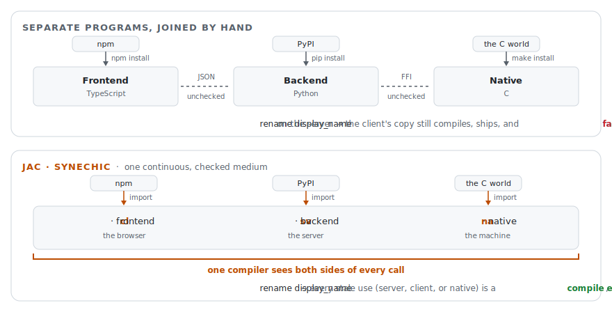
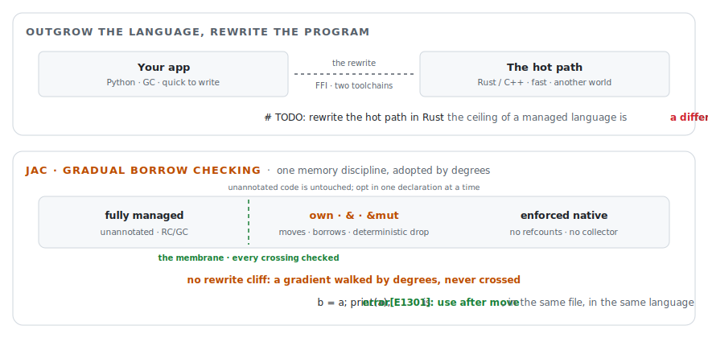
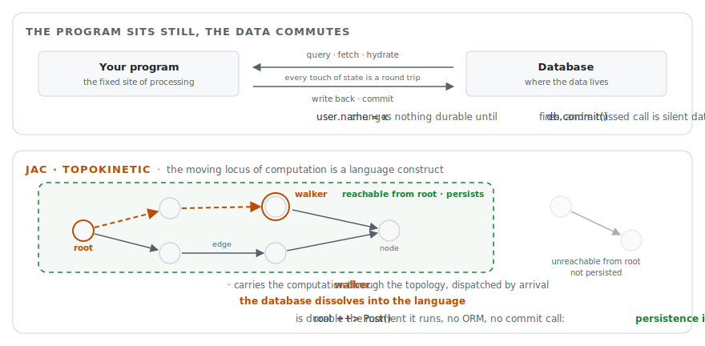
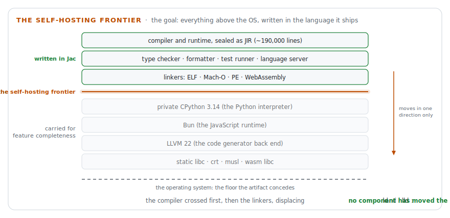

<div align="center">
  

  <h1>The Jac Programming Language</h1>
  <h3>One language, one compiler, the whole stack. No glue.</h3>

  <p>One self-contained binary. One Python-like language. AI, graphs, persistence, APIs, UIs, and cloud deployment as language features, compiled to Python bytecode, JavaScript, and native machine code.</p>

  <p>
    <a href="https://github.com/jaseci-labs/jaseci/releases/latest">
      
    </a>
    <a href="https://github.com/jaseci-labs/jaseci/actions/workflows/ci.yml">
      
    </a>
    <a href="https://codecov.io/gh/Jaseci-Labs/jaseci">
      
    </a>
    <a href="https://github.com/jaseci-labs/jaseci/stargazers">
      
    </a>
    <a href="https://github.com/jaseci-labs/jaseci/releases">
      
    </a>
    <a href="https://discord.gg/6j3QNdtcN6">
      
    </a>
    <a href="LICENSE">
      
    </a>
  </p>

  <p>
    <a href="https://docs.jaseci.org"><b>Docs</b></a> ·
    <a href="https://playground.jaseci.org"><b>Playground</b></a> ·
    <a href="https://docs.jaseci.org/tutorials/first-app/build-ai-day-planner/"><b>Tutorial</b></a> ·
    <a href="https://discord.gg/6j3QNdtcN6"><b>Discord</b></a>
  </p>

  <picture>
    <source media="(prefers-color-scheme: dark)" srcset="docs/docs/assets/readme/demo-dark.svg">
    <source media="(prefers-color-scheme: light)" srcset="docs/docs/assets/readme/demo-light.svg">
    
  </picture>
</div>

Jac is a programming language designed for humans and AI to build together. It compiles one clean, Python-like syntax to Python bytecode, JavaScript, and native machine code, with the entire PyPI, npm, and C ecosystems available without wrappers or interop layers. The things every real application needs (an LLM call, a data model that persists, a REST API, a frontend, a deployment story) are compiler generated and abstracted by the language, not frameworks you assemble around it. The design rests on two properties, *synechic* and *topokinetic* (as described in "[the ninja book](https://zenodo.org/records/21498692)"), and defined further below ("Why Jac").

What you get:

- **One binary, your whole toolchain** -- one download replaces the python interpreter, the JS runtime, the Rust/Zig/C compilers, and the package managers: nothing else to install
- **One language for the whole stack, compiler-checked end to end** -- frontend, backend, and data model are one program under one type checker: humans and AI write correct code faster, and there is one codebase to maintain, not five
- **~5x less code than a modern full-stack setup** -- the difference is glue the compiler now generates: API endpoints, route tables, ORM models, validation, serializers, and migrations you never write, review, or debug
- **AI is a typed function call, not a framework** -- the compiler builds the prompt from your function signature and enforces the return type as the output schema
- **Persistence built in** -- Objects just persist: no database, no ORM, no migrations
- **Laptop to Kubernetes without changing a line** -- `jac start --scale` builds the images and provisions the cluster: you write no Dockerfile and no YAML. The compiler runtime spools out multipod deployments with spliced out microservices.

It's time to show and stop telling. See all of those features running in one single codebase next.

## Try Jac in 30 seconds

Install the self-contained `jac` binary. No Python, pip, Node, or C toolchain required:

```bash
curl -fsSL https://raw.githubusercontent.com/jaseci-labs/jaseci/main/scripts/install.sh | bash
```

Then clone and run [**this_is_jac**](https://github.com/jaseci-labs/this_is_jac), a showcase site built entirely in Jac:

```bash
git clone https://github.com/jaseci-labs/this_is_jac
cd this_is_jac
jac install   # first run: pulls python + npm deps
jac start     # builds the frontend + wasm, serves on http://localhost:8000
```

Open <http://localhost:8000> and scroll.

> Prebuilt binaries ship for **macOS and Linux**; on Windows, use WSL (a native PowerShell installer is coming soon). See the [installation guide](https://docs.jaseci.org/quick-guide/install/) for versions, upgrading, and IDE setup.

## Why Jac exists

Open the repository of any well-built product and count what a maintainer must read: TypeScript, Python, SQL, and shell where the logic lives; JSX and CSS for presentation; JSON, TOML, YAML, Dockerfile, HCL, and dotenv for configuration. Twelve notations, five package ecosystems, two lockfiles. Nobody chose that. It is what precipitates when every architectural seam is also a change of language, type system, package manager, and serialization format.

The deeper cost isn't the reading; it's that **no compiler can see across any of those seams**. Rename one field and TypeScript checks the frontend, Python checks the backend, and *nothing* checks the wire format, the ORM mapping, the OpenAPI document, or the prompt template between them. The whole-program type checker of the modern stack is `grep`. That is where bugs pool, and it's why teams staff a specialist per boundary: the org chart is a picture of the glue.

<details>
<summary><strong>The four-copy record (what one field costs in a conventional stack)</strong></summary>

<br>

One record, maintained in four notations, in one repository:

```sql
CREATE TABLE users (              -- migrations/0004_users.sql
    id UUID PRIMARY KEY,
    email TEXT NOT NULL UNIQUE,
    display_name TEXT NOT NULL );
```

```python
class User(Base):                  # app/models.py (ORM)
    id: Mapped[UUID] = mapped_column(primary_key=True)
    email: Mapped[str] = mapped_column(unique=True)
    display_name: Mapped[str]

class UserOut(BaseModel):          # app/schemas.py (API)
    id: UUID
    email: str
    display_name: str
```

```typescript
export interface User {           // web/src/types/user.ts
    id: string;
    email: string;
    displayName: string;
}
```

Four copies, three type systems, and one landmine: the fourth copy renames `display_name` to `displayName` in a serializer config nobody has reviewed since it was pasted in. Adding one field is a four-file, three-language change plus a migration, a regenerated client, and a cache-key bump -- and not one line of that diff implements behavior. In Jac the record is **one `node` declaration**; the compiler owns its representation in the store, on the wire, and in the browser.

</details>

None of this is required by computation. The pattern traces to two silent assumptions in the 1945 report that defined the stored-program computer: that *computation is stationary* (the site of processing is fixed, and data travels to it), and that *the machine is the program's world* (a program's semantics end at the edge of its process, so frontend and backend, managed and native, script and service are separate programs, joined by hand). Both were engineering defaults for a machine with one memory. Seventy years of habit made them look like laws. Jac is one bet against each.

<div align="center">
  <picture>
    <source media="(prefers-color-scheme: dark)" srcset="docs/docs/assets/readme/synechic-dark.svg">
    <source media="(prefers-color-scheme: light)" srcset="docs/docs/assets/readme/synechic-light.svg">
    
  </picture>
</div>

**Against the second assumption, Jac is synechic** (from the Greek *synecheia*, continuity): one continuous, checked medium across ecosystems, tiers, and toolchains. One language spans frontend, backend, and native code, and inherits each one's ecosystem (PyPI, npm, the C world) through a plain `import`, so one compiler sees both sides of every call: rename a field and every stale use (server, client, or native) is a **compile error**, not a production incident. Building the first production synechic language is the whole point of Jac.

<div align="center">
  <picture>
    <source media="(prefers-color-scheme: dark)" srcset="docs/docs/assets/readme/gradual-borrow-dark.svg">
    <source media="(prefers-color-scheme: light)" srcset="docs/docs/assets/readme/gradual-borrow-light.svg">
    
  </picture>
</div>

That continuity runs all the way down. The deepest seam in computing is the one between managed and systems languages -- today, when the hot path outgrows the garbage collector, the answer is a second language, an FFI boundary, and a rewrite. Jac renders that divide as **gradual borrow checking**: unannotated code keeps fully managed semantics, `own` and `&`/`&mut` opt individual declarations into moves, borrows, and deterministic destruction, a checked boundary (the **membrane**) mediates every value that crosses between the regimes, and full adoption reaches native artifacts with **no reference counting and no collector**. The divide becomes a gradient walked by degrees, never a cliff crossed by starting over. [Gradual borrow checking →](https://docs.jaseci.org/reference/language/ownership-borrowing/)

<details>
<summary><strong>The gradient in code (opt in one declaration at a time)</strong></summary>

<br>

```jac
obj Buffer { has n: int = 0; }

with entry {
    a: own Buffer = Buffer();   # this declaration opts in; the rest of the file is untouched
    v: &Buffer = &a;            # shared borrow of the owner
    a.n = 5;                    # error[E1303]: cannot mutate 'a' while a shared borrow of it is live
    b = a;                      # moves the value out of 'a'
    print(a);                   # error[E1301]: use of 'a' after it was moved
}
```

The checker tracks only what you tag, so `node`, `edge`, and `walker` stay fully managed and the borrow rules never have to reason about the graph. When a module opts in fully, the native pathway compiles it with no RC and no collector in the artifact: systems-language machine code from the same language that serves your web app.

</details>

<div align="center">
  <picture>
    <source media="(prefers-color-scheme: dark)" srcset="docs/docs/assets/readme/topokinetic-dark.svg">
    <source media="(prefers-color-scheme: light)" srcset="docs/docs/assets/readme/topokinetic-light.svg">
    
  </picture>
</div>

**Against the first assumption, Jac is topokinetic** (from the Greek *topos*, place, and *kinesis*, motion): the moving locus of computation is a language construct. In Jac's Object-Spatial Programming, data lives as a persistent topology of nodes and edges, and **walkers** carry computation through it, dispatched by arrival. Whatever is reachable from `root` persists: persistence is a predicate, not an event, and the database dissolves into the language.

The two properties compound, and the dissolved database is the proof: continuity without motion still calls a store outside the language's semantics, and motion without continuity is a graph paradigm marooned in one process. Jac is the first language that is both. And the boundaries that *are* physics stay visible on purpose: a cross-tier call is `async` because the network is real, write conflicts surface as typed errors, and sharing data across users takes an explicit `grant`. Jac deletes the paperwork, not the physics.

The full argument can be found in "the ninja book": [*A Synechic and Topokinetic Programming Language*](https://zenodo.org/records/21498692) develops both language classes and the theory, design and implementation underlying Jac. ([DOI: 10.5281/zenodo.21498692](https://doi.org/10.5281/zenodo.21498692)).

<details>
<summary><strong>Cite the book (BibTeX)</strong></summary>

<br>

Mars, J. (2026). *A Synechic and Topokinetic Programming Language*. Zenodo. https://doi.org/10.5281/zenodo.21498692

```bibtex
@book{mars2026synechic,
  author    = {Mars, Jason},
  title     = {A Synechic and Topokinetic Programming Language},
  year      = {2026},
  publisher = {Zenodo},
  doi       = {10.5281/zenodo.21498692},
  url       = {https://doi.org/10.5281/zenodo.21498692}
}
```

</details>

## For AI agents

Jac is designed for humans and AI to build together, and that includes your coding agent. The lowest-effort setup is no setup: point your agent at the `jac` CLI and tell it to figure it out. A first prompt like this is genuinely enough:

```text
Build me a <your app idea> in Jac. The `jac` binary is installed and self documenting with `jac guide`.
```

The binary is self-documenting -- `jac guide` prints curated reference guides on every corner of the language, and one command extracts them as Agent Skills your agent can load directly:

```bash
jac guide --export ~/.claude/skills
```

For a deeper integration, the `jac` binary also ships an MCP server with Jac validation, formatting, docs, and examples built in. Wire it into Claude Code with one command:

```bash
claude mcp add jac -- jac mcp
```

For Cursor, Windsurf, or any other MCP client, add this to your MCP config (use `jac mcp --mode lite` for smaller models):

```json
{ "mcpServers": { "jac": { "command": "jac", "args": ["mcp"] } } }
```

There's a structural reason agents do better in Jac than in a conventional stack. Glue code is most of what coding models emit (it dominates their training corpora), and glue is exactly the code no tool can verify (or at least you have to add more Glue to verify :-P). It's cheap to generate but expensive to trust. In Jac, entire categories of glue are eliminated, and one compiler checks everything: a whole full-stack app fits in one file that fits in a context window, and a cross-tier mistake an agent makes is a compile error instead of a production surprise.

As discussed in [the ninja book](https://zenodo.org/records/21498692), the key insight is that when authorship is abundant, the scarce resource is *jurisdiction*: the reach of the verifiers that can examine a change and say no, and Jac is built to leave no program point outside it. Even `sem` annotations do triple duty: prompt material for `by llm()`, documentation for humans, context for your agent.

## One binary, your whole toolchain

One download replaces the interpreter, the JS runtime, the compilers and linker, the package managers, the server, and the deployer. At its center is a **polypiler**: a compiler whose unit of compilation is the whole polyglot application and whose targets are ecosystems rather than instruction sets:

<div align="center">
  <picture>
    <source media="(prefers-color-scheme: dark)" srcset="docs/docs/assets/readme/one-binary-dark.svg">
    <source media="(prefers-color-scheme: light)" srcset="docs/docs/assets/readme/one-binary-light.svg">
    
  </picture>
</div>

<details open>
<summary><strong>What's inside the binary (and what you can uninstall)</strong></summary>

<br>

Here is the actual anatomy. The `jac` you download is a small native **launcher stub** with the entire **runtime payload** appended to the same file. The first run unpacks the payload into a per-version cache. Every run after that is instant.

<div align="center">
  <picture>
    <source media="(prefers-color-scheme: dark)" srcset="docs/docs/assets/readme/binary-anatomy-dark.svg">
    <source media="(prefers-color-scheme: light)" srcset="docs/docs/assets/readme/binary-anatomy-light.svg">
    
  </picture>
</div>

| Component | How it's in the binary | What you can uninstall |
|---|---|---|
| **Launcher stub** | The `jac` file itself: native machine code linked against libc only. Everything below rides in the appended payload | -- |
| **CPython 3.14** | A private [python-build-standalone](https://github.com/astral-sh/python-build-standalone) build (PGO+LTO, stripped), `dlopen`ed by the launcher at startup: your system Python is never consulted | Python, pyenv, conda |
| **Jac compiler + runtime** | Precompiled to JIR in the payload's private site: the REST server (`jac start`), client framework, K8s deployer (`--scale`), and byLLM (`by llm()`). Their optional third-party deps (litellm, pymongo, ...) resolve per-project via `jac install` | Flask, FastAPI, Express · Docker, kubectl, Helm · LangChain |
| **Bun** | The real Bun executable, carried inside the payload and invoked by absolute path, never on your `PATH` | Node.js, npm, npx, yarn |
| **LLVM 22** | Statically linked into a single `jacllvm` shared library behind the llvmlite ABI | gcc, clang |
| **Linker + C floor** | Jac's own linker emits ELF / Mach-O / PE / wasm directly. Static libc + crt archives, a musl runtime (Linux), and wasm32 libc bitcode are vendored in the payload | ld, lld, make, cmake, emscripten |
| **Package manager** | pip runs inside the private interpreter, npm resolution goes through the carried Bun: one `jac.toml`, an automatic `.jac/venv`, and `jac x` to run any installed CLI tool | pip, pipx, uv, poetry, venv/virtualenv |
| **Type checker** | Built into the compiler (`jac check`), with the typeshed stdlib stubs vendored at a pinned commit | mypy, pyright, tsc |
| **Dev tooling** | Formatter, test runner, language server, and MCP server are modules of the same site (`jac fmt` / `jac test` / `jac lsp` / `jac mcp`) | black, ruff, pytest, jest |
| **special easter egg** | Only for those with strong jac ninja chi | you will know when you're ready... |

Full story: [One Binary, Build Anything](https://docs.jaseci.org/quick-guide/one-binary/).

</details>

The anatomy records a design position. The components written in Jac (the compiler and runtime at roughly 190,000 lines, the type checker, the formatter and test tooling, and the linkers) sit inside the compiler's own jurisdiction. The carried engines (CPython, Bun, LLVM, and the C runtime archives) are included for feature completeness: each provides a level of compatibility and performance that a reimplementation would not, and each is reached across an ABI, built by a foreign toolchain, and outside the jurisdiction of the language's own verifier. We call the division the **self-hosting frontier**. The design goal is to replace each carried engine with a Jac implementation, so that the entire artifact above the operating system is written in the language it ships, and gradual borrow checking removes the reason these components were written in C and C++ in the first place. The frontier has moved in one direction only: the compiler crossed first, and the linkers followed, displacing `ld` and `lld`. We make no claim about schedule. The full strategy is developed in [the ninja book](https://zenodo.org/records/21498692).

<div align="center">
  <picture>
    <source media="(prefers-color-scheme: dark)" srcset="docs/docs/assets/readme/self-hosting-frontier-dark.svg">
    <source media="(prefers-color-scheme: light)" srcset="docs/docs/assets/readme/self-hosting-frontier-light.svg">
    
  </picture>
</div>

The commands you'll use every day:

| Command | What it does |
| :--- | :--- |
| `jac run main.jac` | Run a program (like `python3`, but for anything) |
| `jac dev` | Live dev loop with hot reload |
| `jac start` | Serve your program: REST API, auth, Swagger docs, frontend |
| `jac build` | Type-check the whole project and emit a sealed app bundle |
| `jac build --as native` | Compile to a standalone, zero-dependency executable |
| `jac install` / `jac x` | Manage PyPI + npm deps / run any installed CLI tool |
| `jac check` / `jac fmt` / `jac test` | Type-check, format, test |
| `jac ai` / `jac mcp` / `jac guide` | Built-in coding agent, MCP server, curated docs |

## Build anything

One language and one skill set produce every kind of software. Each row is one command away:

| What you're building | The command | Guide |
|---|---|---|
| Script / CLI tool | `jac run app.jac` | [CLI & native](https://docs.jaseci.org/build/cli-and-native/) |
| Zero-dependency native executable | `jac build --as native` | [CLI & native](https://docs.jaseci.org/build/cli-and-native/) |
| Single-file app bundle (`.jab`) | `jac build` | [CLI reference](https://docs.jaseci.org/reference/cli/#jac-build) |
| Self-contained app executable | `jac build --as binary` | [CLI reference](https://docs.jaseci.org/reference/cli/#jac-build) |
| REST API (+ Swagger, auth, persistence) | `jac start api.jac` | [Backend APIs](https://docs.jaseci.org/build/backend-apis/) |
| Microservices | `sv import` + `jac start` | [Backend APIs](https://docs.jaseci.org/build/backend-apis/) |
| Full-stack web app | `jac start` | [Full-stack web](https://docs.jaseci.org/build/fullstack-web/) |
| Desktop app (native webview) | `jac build --client desktop` | [Desktop & mobile](https://docs.jaseci.org/build/desktop-mobile/) |
| Mobile app (Android / iOS) | `jac build --client mobile` | [Desktop & mobile](https://docs.jaseci.org/build/desktop-mobile/) |
| AI agents & LLM apps | `by llm()` | [AI agents](https://docs.jaseci.org/build/ai-agents/) |
| Python package (PyPI wheel) | `jac build --as wheel` | [Libraries](https://docs.jaseci.org/build/libraries/) |
| npm package | `jac build --as npm` | [Libraries](https://docs.jaseci.org/build/libraries/) |
| C-ABI shared library (`.so`/`.dylib`/`.dll`) | `jac nacompile lib.na.jac --shared` | [Libraries](https://docs.jaseci.org/build/libraries/) |
| WebAssembly in the browser | `jac build` in a `web-static` project | [Native pathway](https://docs.jaseci.org/reference/language/native-pathway/) |
| Kubernetes deployment | `jac start --scale` | [Deploy & scale](https://docs.jaseci.org/reference/plugins/jac-scale/) |

Three working examples carry the claim: a [playable chess engine](https://docs.jaseci.org/tutorials/native/chess/) compiled to a standalone binary, a [raylib game running as WebAssembly](jac/examples/raylib_shooter/web) in the browser, and [littleX](jac/examples/littleX), a full Twitter-style social app. littleX's entire backend (4 node types, 4 edge types, and 20 walkers that serve as business logic, REST endpoints, persistence, and authorization at once) is **2 files and 475 lines**. The whole app, frontend included, is 37 Jac files with exactly one 65-line config file and **zero glue artifacts**: no route tables, no ORM models, no migrations, no serializers, no auth middleware. A `wc -l` over the tree confirms the counts.

## And build it better

Each of those deliverables is a **project kind**: `jac create myapp --kind <kind>` scaffolds it, stamps the kind into `jac.toml`, and a bare `jac run` dispatches on that kind to execute, serve, or build. The scaffolding is the small part. The point is what the language provides for each kind that a traditional stack assembles by hand:

| `--kind` | What you ship | What Jac adds beyond a traditional language |
|---|---|---|
| `cli` | Terminal script / tool | Graph-native data modeling in a one-off script, a `root` graph that **persists between runs** (no database, no files), and `by llm()` AI with zero glue: the same script in a traditional stack is Python + SQLite + an LLM SDK |
| `cli-native` | Compiled program, run in place | The same source compiled through **statically linked LLVM**: C-level speed with no gcc, clang, or rustc installed |
| `native-binary` | Zero-dependency executable | Jac's own linker emits the ELF/Mach-O/PE file (no `ld` in the loop): the executable runs on machines with no Jac and no Python, territory that otherwise requires C, Rust, or Go |
| `native-lib` | C-ABI shared library (`.so`/`.dylib`/`.dll`) | Expose Jac to **any language with a C FFI** (C, Rust, Go, Python `ctypes`) by marking functions `:pub`: refcounted handles included, and `--target` **cross-builds for Linux/macOS/Windows** with no extra toolchain |
| `service` | Headless REST API | `walker:pub` **is** the endpoint: request bodies map to its fields, `report` is the JSON response, Swagger at `/docs`, and per-user isolated persistence: no FastAPI + SQLAlchemy + Pydantic + auth middleware to wire up |
| `service-mesh` | Microservice cluster | `sv import` **is** the architecture: the compiler turns imports into HTTP stubs, the consumer auto-starts its providers, and env vars re-point services across hosts: no OpenAPI codegen, no client SDKs |
| `py-package` | pip-installable wheel | `jac build --as wheel` with nothing beyond `jac.toml`; the wheel runs under the `jac` binary with **no `jaclang` runtime dependency** |
| `js-package` | npm tarball | Compiles to ES modules with **auto-generated `package.json` and `.d.ts` declarations**, consumable from any JS/TS project, built with no Node.js installed |
| `web-app` | Full-stack web app | Backend, frontend, and data model **in one file**: `cl` code compiles to React, and the compiler generates every RPC and shares types across the boundary, instead of two projects and five frameworks |
| `web-static` | Client-only page | `na {}` blocks compile to **WebAssembly with Jac's own wasm linker** (no emscripten), and `jac build` emits a portable `index.html` that opens straight from disk |
| `desktop`  | Native desktop binary | The same app wrapped in the **OS webview** as one compiled binary: no Electron, no Rust, no PyInstaller |
| `mobile`  | Android / iOS app | The same `cl` bundle wrapped by Capacitor, or true-native React Native via mobUI: JS tooling runs on the bundled Bun, no Node.js |

The full matrix, with a working recipe and guided track for each: [What You Can Build](https://docs.jaseci.org/quick-guide/project-kinds/).

## AI, graphs, and UIs are language features

### Call an LLM like a function

```jac
enum Priority { LOW, MEDIUM, HIGH, URGENT }

def assess(ticket: str) -> Priority by llm();

with entry {
    print(assess("Checkout is down and customers are leaving!"));
    # Priority.URGENT
}
```

There is no prompt, no parsing, and no API glue to write. The compiler constructs the prompt from your function's name, argument names, and types (plus optional `sem` annotations), and the return type is an enforced output schema. These are **meaning types**, the constructs of [Meaning-Typed Programming](https://arxiv.org/abs/2405.08965). Declare your model once in `jac.toml`, run `jac install byllm`, and use any [LiteLLM-compatible provider](https://docs.litellm.ai/docs/providers), or go fully local with `jac install 'byllm[local]'`. [Learn more →](https://docs.jaseci.org/reference/plugins/byllm/)

### Your data is a graph, and walkers are your API

```jac
node Task {
    has title: str;
    has done: bool = False;
}

walker:pub add_task {
    has title: str;
    can create with Root entry {
        task = Task(title=self.title);
        root ++> task;
        report {"id": jid(task), "title": task.title};
    }
}

walker:pub list_tasks {
    can fetch with Root entry {
        report [{"id": jid(t), "title": t.title, "done": t.done}
                for t in [-->][?:Task]];
    }
}
```

```bash
jac start api.jac --no-client   # POST /walker/add_task · /walker/list_tasks
```

Model your domain as nodes and edges, and send **walkers** (mobile computation, dispatched by arrival) to traverse it: this is **Object-Spatial Programming**. Mark a walker `:pub` and `jac start` serves it as a REST endpoint: request bodies map onto its fields, `report` becomes the JSON response, Swagger docs are served at `/docs`, and every user gets their own isolated, persistent graph. Whatever is reachable from `root` persists. No ORM, no schema migrations, no session plumbing. [Object-Spatial Programming →](https://docs.jaseci.org/tutorials/language/osp/)

### Frontend and backend in one file

```jac
node Todo {
    has title: str, done: bool = False;
}

def:pub add_todo(title: str) -> Todo {
    todo = Todo(title=title);
    root ++> todo;
    return todo;
}

def:pub get_todos -> list[Todo] {
    return [root-->][?:Todo];
}

cl def:pub app -> JsxElement {
    has todos: list[Todo] = [], text: str = "";
    async can with entry { todos = await get_todos(); }
    async def add {
        if text.strip() {
            todos = todos + [await add_todo(text.strip())];
            text = "";
        }
    }
    return <div>
        <input value={text}
            onChange={lambda e: ChangeEvent { text = e.target.value; }}
            placeholder="Add a todo..." />
        <button onClick={add}>Add</button>
        {[<p key={jid(t)}>{t.title}</p> for t in todos]}
    </div>;
}
```

Code in `cl` (the client **codespace**) compiles to a React/JSX bundle for the browser. Everything else compiles to Python for the server. That `await add_todo(...)` in the click handler is a real RPC: the compiler generates the HTTP call, serialization, and shared types across the boundary. `jac start` serves it, and `jac start --dev` adds hot reload. [Full-stack tutorial →](https://docs.jaseci.org/build/fullstack-web/)

For all three ideas in one file (an AI categorizer, a native-compiled scoring function, a persistent graph, and a React UI), see [`jac/examples/mini_todo`](jac/examples/mini_todo).

## Laptop to Kubernetes without changing your code

```bash
jac start main.jac           # local: REST API + auth + Swagger + persistence
jac start main.jac --scale   # cloud: Kubernetes with Redis, MongoDB, load balancing
```

Your program text does not change with the shape of its deployment: this is **scale invariance**, and the `scale` subsystem that delivers it ships inside the binary. `--scale` builds the images, provisions Redis and MongoDB, and deploys to Kubernetes with health checks. You write no Dockerfile and no YAML, and what stays in your code is only the physics: latency, failure, and cost surface as typed semantics. [Deploy & scale →](https://docs.jaseci.org/reference/plugins/jac-scale/)

## What's in this repo

This is the Jaseci monorepo, home to everything that makes Jac work:

| Directory | What it is |
|---|---|
| [`jac/`](jac/) | **jaclang** -- the compiler, runtime, and everything inside the `jac` binary: the language, the full-stack client framework, the `scale` deployment subsystem, the MCP server, and the LLVM native pathway |
| [`jac-byllm/`](jac-byllm/) | **byllm** -- AI/LLM integration via Meaning-Typed Programming (`jac install byllm`) |
| [`docs/`](docs/) | The documentation site at [docs.jaseci.org](https://docs.jaseci.org) |
| [`scripts/`](scripts/) | The installer and release tooling |

The official VS Code extension lives at [jaseci-labs/jac-vscode](https://github.com/jaseci-labs/jac-vscode).

## Research

Jac's core ideas are peer-reviewed research, not just design taste:

- **Object-Spatial Programming** -- the formal model behind nodes, edges, and walkers: mobile computation over a persistent typed topology ([arXiv:2503.15812](https://arxiv.org/abs/2503.15812))
- **MTP: A Meaning-Typed Language Abstraction for AI-Integrated Programming** -- `by llm()` and `sem`, evaluated against hand-built prompt pipelines: comparable-or-better accuracy with substantially less code and lower token cost (OOPSLA 2025, [arXiv:2405.08965](https://arxiv.org/abs/2405.08965))
- **The Jaseci Programming Paradigm and Runtime Stack** -- the production lineage: walkers served as scale-out endpoints in commercial products (IEEE Computer Architecture Letters, 2023)

The book-length treatment is published: [*A Synechic and Topokinetic Programming Language*](https://zenodo.org/records/21498692) develops the synechic and topokinetic language classes and the theory beneath Jac's design ([DOI: 10.5281/zenodo.21498692](https://doi.org/10.5281/zenodo.21498692)). The project grew out of research at the University of Michigan and is now developed in the open by a global community. To cite Jac in your own work, GitHub's "Cite this repository" button (powered by [CITATION.cff](CITATION.cff)) gives a ready-made reference. More on [docs.jaseci.org: Research & Papers](https://docs.jaseci.org/community/research/).

## Built with Jac

| Project | Description |
|---------|-------------|
| [**JacHammer**](https://jachammer.ai/) | AI-powered app builder that generates, previews, and ships full-stack Jac apps, on web and mobile |
| [**Sigil**](https://sigilagent.com/) | The skill compiler: plain-Markdown skills compiled into typed agent harnesses that models run inside |
| [**mars.ninja**](https://mars.ninja/) | The personal site of Jac's creator, built end to end in Jac |

If you're building something with Jac, tell us on [Discord](https://discord.gg/6j3QNdtcN6) and we'll add it here.

Jaseci is a member of the [NVIDIA Inception Program](https://www.nvidia.com/en-us/startups/) for cutting-edge AI startups.

## Contributing

We welcome contributions of every size, from typo fixes to compiler passes.

- **Ask questions & share ideas** on our [Discord server](https://discord.gg/6j3QNdtcN6)
- **Report bugs** via [GitHub issues](https://github.com/jaseci-labs/jaseci/issues)
- **Send PRs**: start with the [contributing guide](https://docs.jaseci.org/community/contributing/) and [CONTRIBUTING.md](CONTRIBUTING.md); `bash scripts/fresh_env.sh` sets up a dev environment

If Jac looks useful to you, [**star the repo**](https://github.com/jaseci-labs/jaseci/stargazers). It helps other developers discover the project.

## License

Jac and the Jaseci stack are [MIT licensed](LICENSE). Vendored third-party components retain their own permissive licenses.

<div align="center">
  <a href="https://star-history.com/#jaseci-labs/jaseci&Date">
    <picture>
      <source media="(prefers-color-scheme: dark)" srcset="https://api.star-history.com/svg?repos=jaseci-labs/jaseci&type=Date&theme=dark">
      <source media="(prefers-color-scheme: light)" srcset="https://api.star-history.com/svg?repos=jaseci-labs/jaseci&type=Date">
      
    </picture>
  </a>
</div>
