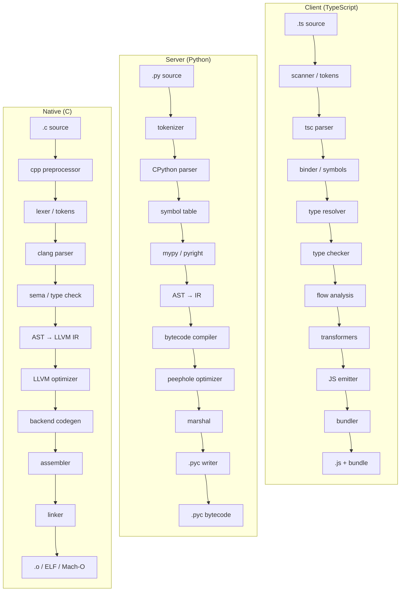
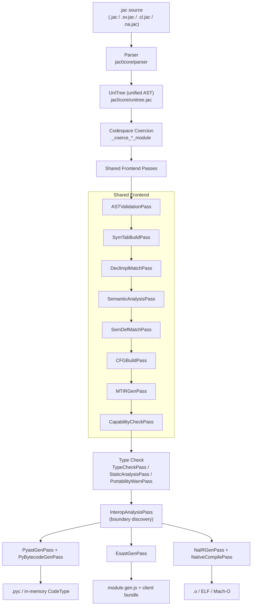
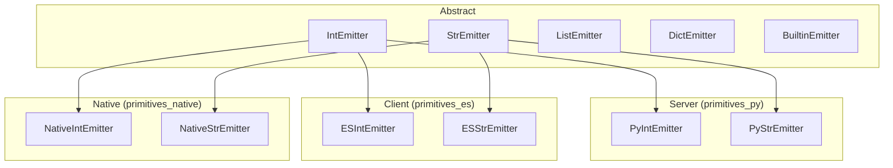

# Compiler Architecture: Three Codespaces

## Overview

Jac is a single source language that compiles to three different execution
targets, called **codespaces**:

| Codespace | Selector | Backend output | Runs on |
|-----------|----------|----------------|---------|
| **Server** (`sv`) | Default for unmarked code; explicit `sv { }` block, `sv` prefix, or `.sv.jac` file | Python AST → CPython bytecode | CPython |
| **Client** (`cl`) | **Inferred** from client-only syntax (JSX, string-path npm imports) and symbol references; explicit `cl { }` block, `cl` prefix, or `.cl.jac` file | ESTree → JavaScript | Browsers / Node |
| **Native** (`na`) | Always explicit: `na { }` block, `na` prefix, or `.na.jac` file (never inferred) | LLVM IR → object code → executable | Bare machine (Linux / macOS, x86_64 / arm64) |

A single `.jac` file can mix all three codespaces, with or without markers.
The compiler routes each declaration to the correct backend, synthesises the
interop bridges at the boundary, and emits the appropriate artefact per
codespace. Explicit markers always take precedence over inference.

This document is the architectural map of how that pipeline is wired
together. It is intended for compiler contributors. For language-level
behaviour see [Primitives & Codespace Semantics](../reference/language/primitives.md);
for the user-facing native pathway see [Native Compilation](../reference/language/native-pathway.md).

---

## The Typical Polyglot Today

A typical full-stack feature today is built from three separate toolchains
that never see each other. Each language has its own parser, type system,
and codegen, and the "interop" is whatever the developer hand-writes at the
edges (HTTP payloads, FFI declarations, JSON contracts).



Three disconnected pipelines, three languages to know, and every
cross-boundary call is a hand-rolled contract that the toolchain cannot
verify. Jac collapses this into a single front end with three backends, so
the interop boundaries become a compiler concern instead of a developer one.

---

## Pipeline at a Glance



The orchestration lives in [`jac0core/compiler.jac`](https://github.com/Jaseci-Labs/jaseci/blob/main/jac/jaclang/jac0core/compiler.jac).
Each named "schedule" function returns a list of `Transform[uni.Module, uni.Module]`
classes to run, and the `JacCompiler.compile` method walks them in order.

---

## Stage 1: Parsing and the Unified AST

Every codespace shares the **same front end**.

- Tokens are declared in [`jac0core/parser/tokens.na.jac`](https://github.com/Jaseci-Labs/jaseci/blob/main/jac/jaclang/jac0core/parser/tokens.na.jac).
  The `sv`, `cl`, and `na` keywords are ordinary tokens -- no codespace
  has a separate grammar.
- The grammar is in [`jac0core/parser/impl/parser.impl.jac`](https://github.com/Jaseci-Labs/jaseci/blob/main/jac/jaclang/jac0core/parser/impl/parser.impl.jac).
- AST nodes are defined in [`jac0core/unitree.jac`](https://github.com/Jaseci-Labs/jaseci/blob/main/jac/jaclang/jac0core/unitree.jac)
  (catalogued in [UniIR Nodes](uniir_node.md)).

Codespace-tagged regions surface as three sibling AST nodes:

| Source form | AST node |
|-------------|----------|
| `sv { ... }` block | `ServerBlock` |
| `cl { ... }` block | `ClientBlock` |
| `na { ... }` block | `NativeBlock` |

The bootstrap compiler (`jac0.py`) and the full compiler share this front end
verbatim -- see [Abstractions Inventory](abstractions.md) for the full keyword
table.

---

## Stage 2: Codespace Coercion

After parsing, the compiler decides what context each top-level statement
belongs to. This is driven by the file extension and by the codespace
blocks in the source.

The coercion helpers live in
[`compiler.jac:_coerce_module`](https://github.com/Jaseci-Labs/jaseci/blob/main/jac/jaclang/jac0core/compiler.jac#L250)
and three wrappers around it:

| Helper | Triggered by | What it does |
|--------|--------------|--------------|
| `_coerce_server_module` | `.sv.jac` extension | Unfolds `ServerBlock`, strips `ClientBlock`, marks remaining nodes `CodeContext.SERVER` |
| `_coerce_client_module` | `.cl.jac` extension | Unfolds `ClientBlock`, strips `ServerBlock`, marks `CodeContext.CLIENT` |
| `_coerce_native_module` | `.na.jac` extension | Unfolds `NativeBlock`, strips both `ServerBlock` and `ClientBlock`, marks `CodeContext.NATIVE` |

For mixed `.jac` files, a `sv { ... }` / `cl { ... }` / `na { ... }` block
tags each `ContextAwareNode` inside it with its `code_context`. From this
point on, every declaration carries a `CodeContext` enum value that
downstream passes use to dispatch to the correct backend.

### Codespace inference (markerless modules)

Plain `.jac` files with no explicit markers get their client placement
**inferred** in two stages:

1. **Seeding** (`compiler.jac:_seed_module_codespace`, invoked from
   `parse_str` right where extension coercion runs): any top-level element
   whose subtree contains structurally client-only syntax -- a `JsxElement`
   or a string-path (npm/asset) import -- is stamped `CodeContext.CLIENT`.
   Seeds run at parse time because the stamps gate schedule selection
   itself (`declares_codespace` decides which pipelines a module gets).
2. **Propagation** (`CodespacePullPass` in
   [`jac0core/passes/codespace_pull_pass.jac`](https://github.com/Jaseci-Labs/jaseci/blob/main/jac/jaclang/jac0core/passes/codespace_pull_pass.jac),
   scheduled in both `get_symtab_ir_sched` and `get_ir_gen_sched`): once
   symbol tables exist, CLIENT placement flows across resolved symbol
   references between top-level elements to a fixpoint. Resolution is
   scope-aware, so locals shadowing module-level names produce no edge.
   Pulls skip element kinds the backends already bridge across the
   boundary: top-level archetypes (auto-shared into the bundle),
   access-tagged abilities and globals (auto-RPC endpoints), and type
   aliases (erased in JS output).

Import classification has a single source of truth as computed getters on
`uni.Import` (`has_string_path`, `is_sv_marked`, `is_virtual_jac`,
`ecosystem`) plus `ModulePath.string_path_value`. On imports,
`code_context` means **placement** (which side consumes the import) while
the `sv` marker is a **boundary fact** (the target stays server-side):
client-consumed `sv import`s become RPC stubs, server-consumed ones become
server-to-server microservice calls. Native contexts are never inferred;
`na` markers or `nacompile` auto-promotion remain the only native paths.
Explicit markers of any kind are never overridden by inference.

---

## Stage 3: Shared Frontend Analysis

These passes run regardless of codespace and are collected by
`get_ir_gen_sched` and `get_type_check_sched` in
[`compiler.jac`](https://github.com/Jaseci-Labs/jaseci/blob/main/jac/jaclang/jac0core/compiler.jac#L42).

| Pass | Source | Role |
|------|--------|------|
| `ASTValidationPass` | [`jac0core/passes/ast_validation_pass.jac`](https://github.com/Jaseci-Labs/jaseci/blob/main/jac/jaclang/jac0core/passes/ast_validation_pass.jac) | Structural validation of the parsed tree |
| `SymTabBuildPass` | [`jac0core/passes/sym_tab_build_pass.jac`](https://github.com/Jaseci-Labs/jaseci/blob/main/jac/jaclang/jac0core/passes/sym_tab_build_pass.jac) | Builds symbol tables; enforces sealed-field rules for archetypes |
| `DeclImplMatchPass` | [`jac0core/passes/decl_impl_match_pass.jac`](https://github.com/Jaseci-Labs/jaseci/blob/main/jac/jaclang/jac0core/passes/decl_impl_match_pass.jac) | Pairs declarations in `.jac` files with bodies in `.impl.jac` annexes |
| `SemanticAnalysisPass` | [`jac0core/passes/semantic_analysis_pass.jac`](https://github.com/Jaseci-Labs/jaseci/blob/main/jac/jaclang/jac0core/passes/semantic_analysis_pass.jac) | Name resolution, scope analysis |
| `SemDefMatchPass` | [`compiler/passes/main/sem_def_match_pass.jac`](https://github.com/Jaseci-Labs/jaseci/blob/main/jac/jaclang/compiler/passes/main/sem_def_match_pass.jac) | Matches `sem` blocks to definitions for `by llm` |
| `CFGBuildPass` | [`compiler/passes/main/cfg_build_pass.jac`](https://github.com/Jaseci-Labs/jaseci/blob/main/jac/jaclang/compiler/passes/main/cfg_build_pass.jac) | Builds control-flow graphs |
| `MTIRGenPass` | [`compiler/passes/main/mtir_gen_pass.jac`](https://github.com/Jaseci-Labs/jaseci/blob/main/jac/jaclang/compiler/passes/main/mtir_gen_pass.jac) | Generates Meaning-Typed IR for `by llm` calls |
| `CapabilityCheckPass` | [`compiler/passes/main/capability_check_pass.jac`](https://github.com/Jaseci-Labs/jaseci/blob/main/jac/jaclang/compiler/passes/main/capability_check_pass.jac) | Stamps capability/portability facts (native auto-promotion eligibility) on module nodes |
| `CodespacePullPass` | [`jac0core/passes/codespace_pull_pass.jac`](https://github.com/Jaseci-Labs/jaseci/blob/main/jac/jaclang/jac0core/passes/codespace_pull_pass.jac) | Propagates inferred CLIENT placement through scope-aware symbol references (see Stage 2) |
| `TypeCheckPass` | [`compiler/passes/main/type_checker_pass.jac`](https://github.com/Jaseci-Labs/jaseci/blob/main/jac/jaclang/compiler/passes/main/type_checker_pass.jac) | Static type checking against the type registry |
| `PortabilityWarnPass` | [`compiler/passes/main/capability_check_pass.jac`](https://github.com/Jaseci-Labs/jaseci/blob/main/jac/jaclang/compiler/passes/main/capability_check_pass.jac) | Emits portability warnings (W6001-W6004) for JS-idiom violations; diagnostic-only, runs in the check-extras schedule |

The pipeline uses a **re-entrancy guard** (`_ir_sched_loading`,
`_codegen_sched_loading`, `_typecheck_sched_loading`) so that compiling the
compiler's own pass modules degrades gracefully to the bootstrap subset
instead of recursing forever.

---

## One Owner Per Analysis: The Analysis Contract

Every semantic fact about a Jac program is computed exactly once, by the
central analysis pipeline, and recorded on the unitree or in a registry
hanging off it. The backends are pure consumers: they read annotations
and emit target code. The contract (tracked in jaseci-labs/jaseci#6542):

1. **Single owner.** For every analysis there is one pass or module that
   computes it. A second implementation - even a "cheap local check" -
   is a defect.
2. **No fallbacks.** When a backend needs a fact and the annotation is
   absent, that is an internal-contract diagnostic (E9002), never a
   silent default.
3. **The unitree is the program.** Semantic facts live on nodes
   (annotate, never mutate surface syntax - the formatter/LSP fidelity
   constraint stands).
4. **Analysis before codegen.** Codegen passes may not invoke the type
   evaluator, walk annotation ASTs, or run symbol-table lookups; they
   read stamped facts and registries. `tests/compiler/test_backend_purity.jac`
   enforces this mechanically with a ratcheting allowlist.
5. **Tighten semantics where it simplifies.** Where backends used to
   guess independently, the semantic is defined once centrally and all
   backends hold to it (e.g. user-shadowed builtins are decided by the
   stamped call classification everywhere).
6. **Representation growth is cached growth.** New unitree fields are
   either serialized through the JIR registry with a format bump, or
   documented recompute-on-load (`postinit` fields like `Expr.type`).

### The authority map

| Fact | Owner | Stamped/queried as |
|------|-------|--------------------|
| Expression types | TypeCheckPass / TypeEvaluator | `Expr.type` (recompute-on-load) |
| Symbol storage class, rebinding | Symbol tables | `Symbol.storage`, `NameAtom.binds_new_var`, defn/uses |
| Call classification | `symbol_utils.classify_call` via checker | `FuncCall.call_kind` |
| Resolved callee | `symbol_utils.ability_of_symbol` via checker | `FuncCall.callee_decl` (recompute-on-load) |
| OSP archetype kind / event triggers | checker + unitree getters | `Archetype.arch_kind`, `Ability.event_triggers`, `Ability.event_trigger_type_names()` |
| Closure captures | scope tables | `UniScopeNode.get_enclosing_captures`, `LambdaExpr.captures` |
| Class hierarchy, MRO, vtable need | `LayoutPass` / `LayoutRegistry` | `get_layout_registry(module)` queries (no copies) |
| Result ownership (+1 transfer) | `compiler/ownership.jac` | `result_ownership(expr)`, applied at one emission seam |
| Borrowed-param promotion | `compiler/ownership.jac` | `param_plainly_rebound(sym)`, entry-block retain |
| Loop-exit release lists | `compiler/ownership.jac` | `loop_body_locals(body)` |
| Capability / portability | `capability_check_pass.jac` | declarative disqualifier + stdlib + explicit-native rejection tables, `native_capability_violations(mod)` pre-codegen sweep, W6001-W6004 |
| Foreign declarations (clib surface) | `compiler/targets/foreign.jac` | `collect_foreign_structs/fns`, `foreign_struct_layout` (declared names in, layouts out) |
| Foreign ABI classification + call plans | `compiler/targets/abi.jac` | `classify_struct(...)`, `classify_foreign_fn(...)` (pure, unit-tested) |
| Codegen-time expression-type reads | `type_system/type_utils.jac` | `expr_primitive_name(prog, expr)`: stamp when present, lazy authority query otherwise |

What stays per-backend by design: target IR construction and emission,
runtime libraries, backend-idiomatic lowering choices, emitter-created
temporaries (boxing, coercion buffers - their bookkeeping is driven by
the central classification of their source expressions), and
annotation-surface-shape decisions (what the user literally wrote,
which stamped types deliberately erase).

### The end-state purity contract

The relocation plan (jaseci-labs/jaseci#6542) is complete.
`tests/compiler/test_backend_purity.jac` is its standing contract:
`MIGRATION_DEBT` is empty, and every remaining analysis-API match in a
backend source is `SANCTIONED` with a per-entry rationale and an exact
count - growth means unreviewed analysis crept back in, shrink means an
entry earned tightening; both fail the test until the table is edited
deliberately.

Two design decisions bound what "fully stamped" means:

- **Lazy expression types.** `Expr.type` is the evaluator's memoization,
  populated by whatever checking rules evaluate; measured across the ES
  and OSP corpora, a present stamp never disagrees with the evaluator -
  the gap is purely coverage over arbitrary shapes (call results,
  compare results, member chains). Eager completion is unsound without a
  side-effect-free evaluator query mode (standalone evaluation binds
  member symbols and caches results, perturbing later context-aware
  checking - measured, twice). So codegen-time reads go through
  `expr_primitive_name`, which fills gaps lazily; late-query diagnostics
  ride the checker's deferral machinery.

- **Ownership seam tables (Phase 7 follow-up): not pursued.** The
  central facts that pay for themselves are landed
  (`result_ownership`, `param_plainly_rebound`, `loop_body_locals`).
  The remaining `_mark_owned`/`_is_owned` sites track emitter-created
  temporaries - values with no AST identity, created and consumed inside
  single lowering routines. A central table for them would mirror
  emission order rather than describe the program; the invariant
  (every value-consumption seam releases its owned temps) is enforced by
  the leak-check gates (chess fixture under JAC_RC_DEBUG_CODEGEN, the GC
  suite) rather than by a second bookkeeping layer.

---

## Stage 4: Boundary Discovery -- `InteropAnalysisPass`

[`InteropAnalysisPass`](https://github.com/Jaseci-Labs/jaseci/blob/main/jac/jaclang/jac0core/passes/interop_analysis_pass.jac)
runs once *before* code generation. It walks every call site and records:

1. The `CodeContext` of the **caller** and **callee** (SERVER / CLIENT / NATIVE).
2. Type information on each parameter and return value at the boundary.
3. Imports that cross from a Python module into a `.na.jac` module (for
   native↔native linking).
4. Server-to-server calls that resolve to a different microservice
   (`sv import`).

The result is attached to the module as an `InteropManifest` of
`InteropBinding` entries (defined in
[`jac0core/codeinfo.jac`](https://github.com/Jaseci-Labs/jaseci/blob/main/jac/jaclang/jac0core/codeinfo.jac)).
Each backend reads this manifest and generates the appropriate bridge
stub: an HTTP fetch for `cl → sv`, a ctypes call for `sv → na`, or a
direct native symbol reference for `na → na`.

---

## Stage 5: Backend Code Generation

`get_py_code_gen` returns the codegen schedule. All three backends share a
common base class -- [`ModuleCodegenPass`](https://github.com/Jaseci-Labs/jaseci/blob/main/jac/jaclang/jac0core/passes/module_codegen_pass.jac)
(or `BaseAstGenPass` for AST-emitting passes) -- and **each pass only emits
nodes whose `code_context` matches its target**. A node tagged `CLIENT` is
invisible to the Python codegen and vice versa.

### Server backend -- `sv { }`

| Pass | Source | Output |
|------|--------|--------|
| `PyastGenPass` | [`jac0core/passes/pyast_gen_pass.jac`](https://github.com/Jaseci-Labs/jaseci/blob/main/jac/jaclang/jac0core/passes/pyast_gen_pass.jac) (+ [impl](https://github.com/Jaseci-Labs/jaseci/blob/main/jac/jaclang/jac0core/passes/impl/pyast_gen_pass.impl.jac)) | Python `ast.Module` |
| `PyJacAstLinkPass` | [`compiler/passes/main/pyjac_ast_link_pass.jac`](https://github.com/Jaseci-Labs/jaseci/blob/main/jac/jaclang/compiler/passes/main/pyjac_ast_link_pass.jac) | Back-links Python AST nodes to the originating Jac nodes (used for diagnostics and the type registry) |
| `PyBytecodeGenPass` | [`jac0core/passes/pybc_gen_pass.jac`](https://github.com/Jaseci-Labs/jaseci/blob/main/jac/jaclang/jac0core/passes/pybc_gen_pass.jac) | `types.CodeType` via `compile()` |

Archetype `has` fields become dataclass fields wrapped with
`_.field(default=…)` or `_.field(factory=lambda: …)`. Walkers, nodes, and
edges descend from the corresponding `Archetype` subclasses in
[`jac0core/archetype.jac`](https://github.com/Jaseci-Labs/jaseci/blob/main/jac/jaclang/jac0core/archetype.jac).
Builtins and language keywords ultimately resolve to methods on
`JacRuntimeInterface` in [`jac0core/runtime.jac`](https://github.com/Jaseci-Labs/jaseci/blob/main/jac/jaclang/jac0core/runtime.jac).

The primitive type contract for this backend lives in
[`pycore/passes/primitives_py.jac`](https://github.com/Jaseci-Labs/jaseci/blob/main/jac/jaclang/pycore/passes/primitives_py.jac).

### Client backend -- `cl { }`

| Pass | Source | Output |
|------|--------|--------|
| `EsastGenPass` | [`compiler/passes/ecmascript/esast_gen_pass.jac`](https://github.com/Jaseci-Labs/jaseci/blob/main/jac/jaclang/compiler/passes/ecmascript/esast_gen_pass.jac) (+ [impl](https://github.com/Jaseci-Labs/jaseci/blob/main/jac/jaclang/compiler/passes/ecmascript/impl/esast_gen_pass.impl.jac)) | ESTree AST + serialised JS (`module.gen.js`) |

`EsastGenPass` derives from `BaseAstGenPass` (shared with `PyastGenPass`)
so the same traversal infrastructure visits the tree but emits ESTree
nodes from [`compiler/passes/ecmascript/estree.jac`](https://github.com/Jaseci-Labs/jaseci/blob/main/jac/jaclang/compiler/passes/ecmascript/estree.jac).
Key components of the client backend:

- **Primitive emitters** -- [`primitives_es.jac`](https://github.com/Jaseci-Labs/jaseci/blob/main/jac/jaclang/compiler/passes/ecmascript/primitives_es.jac)
  provides `ESIntEmitter`, `ESStrEmitter`, etc. that satisfy the abstract
  emitter contract (see *Primitive Emitter Contract* below).
- **Unparser** -- [`es_unparse.jac`](https://github.com/Jaseci-Labs/jaseci/blob/main/jac/jaclang/compiler/passes/ecmascript/es_unparse.jac)
  walks the ESTree and prints JavaScript source.
- **Runtime** -- [`jac_runtime_js.jac`](https://github.com/Jaseci-Labs/jaseci/blob/main/jac/jaclang/compiler/passes/ecmascript/jac_runtime_js.jac)
  is the small JS runtime that ships with every client bundle (signals,
  reactive state, JSX renderer, hash router, fetch helpers).
- **JSX lowering** -- `EsJsxProcessor` in
  [`jac0core/passes/ast_gen/jsx_processor.jac`](https://github.com/Jaseci-Labs/jaseci/blob/main/jac/jaclang/jac0core/passes/ast_gen/jsx_processor.jac)
  is shared between the server and client AST generators so JSX tags compile
  consistently regardless of where they appear.

The client framework (built into `jaclang` core) packages the generated
`module.gen.js`, the JS runtime, and an HTML shell into a static bundle. Cross-codespace calls
(`cl → sv`) are lowered into HTTP requests against the walker / function
endpoints exposed by `jac start`. The client is currently **CSR-only**:
the server returns an HTML shell with a bootstrapping payload, and the
browser handles all rendering.

### Native backend -- `na { }`

| Pass | Source | Output |
|------|--------|--------|
| `NaIRGenPass` | [`compiler/passes/native/na_ir_gen_pass.jac`](https://github.com/Jaseci-Labs/jaseci/blob/main/jac/jaclang/compiler/passes/native/na_ir_gen_pass.jac) | LLVM IR (`llvmlite.ir.Module`) |
| `NativeCompilePass` | [`compiler/passes/native/na_compile_pass.jac`](https://github.com/Jaseci-Labs/jaseci/blob/main/jac/jaclang/compiler/passes/native/na_compile_pass.jac) | Object code (ELF or Mach-O) |

`NaIRGenPass` is unusual in that it does **not** use the visitor pattern;
LLVM requires instructions to be emitted into specific basic blocks in
order, so it walks the AST manually. The pass derives directly from
`ModuleCodegenPass`. Primitive types are defined in
[`primitives_native.jac`](https://github.com/Jaseci-Labs/jaseci/blob/main/jac/jaclang/compiler/passes/native/primitives_native.jac).

Linking is also self-contained -- no external linker is invoked:

- [`linker_common.jac`](https://github.com/Jaseci-Labs/jaseci/blob/main/jac/jaclang/compiler/passes/native/linker_common.jac)
  -- shared layout logic
- [`elf_linker.jac`](https://github.com/Jaseci-Labs/jaseci/blob/main/jac/jaclang/compiler/passes/native/elf_linker.jac)
  -- Linux ELF64 object writer
- [`macho_linker.jac`](https://github.com/Jaseci-Labs/jaseci/blob/main/jac/jaclang/compiler/passes/native/macho_linker.jac)
  -- macOS Mach-O object writer

The native backend supplies its own memory management: a 32-byte
allocation header with reference counts (see `HDR_*` globals in
`na_ir_gen_pass.jac`). Cross-codespace calls between Python and native
flow through the interop bridge generated from `InteropAnalysisPass`.

---

## Primitive Emitter Contract

Every backend implements the same abstract emitter interface. This is what
makes "`'hello'.upper()` works in all three codespaces" a guarantee rather
than a convention.



Twelve emitter families are defined, one per primitive type (`int`,
`float`, `str`, `bytes`, `list`, `dict`, `set`, `frozenset`, `tuple`,
`range`, `complex`) plus `BuiltinEmitter` for top-level functions like
`print()`, `len()`, `range()`, `sorted()`. The codegen pass calls
`StrEmitter.emit_op_add(...)` and the appropriate subclass produces
Python `BinOp`, an ES `BinaryExpression`, or an LLVM `call @str_concat`.

If a backend hasn't implemented an operation, the emitter returns `None`
and the compiler raises a diagnostic at compile time -- see the diagnostic
codes in [`jac0core/diagnostics.jac`](https://github.com/Jaseci-Labs/jaseci/blob/main/jac/jaclang/jac0core/diagnostics.jac).

The full list of primitives and operators per type lives in the
user-facing reference, [Primitives & Codespace Semantics](../reference/language/primitives.md).

---

## Cross-Codespace Interop

`InteropAnalysisPass` discovers boundaries; the backends close them.

| Direction | Bridge | Generated by |
|-----------|--------|--------------|
| `cl → sv` | HTTP `POST` to the walker / function endpoint exposed by `jac start` | `EsastGenPass` emits `fetch(...)` against the URL recorded in the binding |
| `sv → cl` | None at runtime -- the client mounts its own DOM. The server only ships the bootstrap payload | `PyastGenPass` emits the static-file route for the bundle |
| `sv → na` | In-process `ctypes.CFUNCTYPE` over the JIT'd function address (MCJIT); an AOT `--shared` build is loaded across the process boundary instead | `PyastGenPass` emits the ctypes stub; `NaIRGenPass` exposes the function with C ABI |
| `na → sv` | Python callback wrapped in a `ctypes.CFUNCTYPE` and registered as a JIT symbol (`llvm.add_symbol`), so MCJIT resolves the native call back into CPython | `interop_bridge.register_py_callbacks`, alongside the `sv → na` stub |
| `na → na` | Direct symbol reference resolved by the in-tree linker | `InteropAnalysisPass` records the import; `NativeCompilePass` emits the relocation |
| `sv → sv` (microservice) | HTTP between processes when an `sv import` resolves to a different deployment | `PyastGenPass` emits a generated `__jac_sv_client` RPC stub; the manifest is consumed by the built-in `scale` subsystem |

Boundary types are serialised through the schemas in
[`codeinfo.jac`](https://github.com/Jaseci-Labs/jaseci/blob/main/jac/jaclang/jac0core/codeinfo.jac).
The primitive contract guarantees that types like `int` and `list[str]`
mean the same thing on both sides; non-primitive types must be reachable
in both codespaces (typically as plain `obj` archetypes).

For the full interop matrix -- every ordered pair plus the foreign (C),
WebAssembly, and Python boundaries, the marshalling format, and how desktop
apps stitch several boundaries together -- see
[Cross-Codespace & Foreign Interop](interop.md).

---

## Caching

The compiler keeps two on-disk caches so the front end and back end can be
skipped when nothing has changed.

| Cache | Location | Invalidated when |
|-------|----------|------------------|
| **Bootstrap** | `~/.cache/jac/jir/bootstrap/` | A `jac0core/` file or `jac0.py` changes |
| **Module** | `~/.cache/jac/jir/modules/` | The full compiler's output format changes, or the source / its imports change |

Each cache entry is a **JIR file** (Jac IR) with named sections defined in
[`jac0core/jir.jac`](https://github.com/Jaseci-Labs/jaseci/blob/main/jac/jaclang/jac0core/jir.jac):

| Section | Contents |
|---------|----------|
| `SEC_BYTECODE` | Marshalled Python `CodeType` (server backend) |
| `SEC_MTIR` | Meaning-Typed IR for `by llm` calls |
| `SEC_LLVM_IR` | LLVM IR text (native backend) |
| `SEC_NATIVE_OBJ` | Compiled ELF/Mach-O object (native backend) |
| `SEC_INTEROP` | Serialised `InteropManifest` |

A precompiled section is replayed via `JacCompiler._load_native_from_cache`
/ `_load_native_from_bitcode` instead of re-running the codegen pass.

When debugging compiler changes, clear the relevant cache:

```bash
# Bootstrap or core compiler change
rm -rf ~/.cache/jac/jir/

# Or just user modules
rm -rf ~/.cache/jac/jir/modules/
```

---

### The JIR-carries-semantics decision (Phase 10 gate)

Measured 2026-06-11 on the chess fixture (3 runs each): warm cache-hit
runs ~4.9s with the analysis pipeline fully skipped (bytecode and LLVM
sections load directly); cold compiles ~182s with inference vs ~76s
with inference disabled - inference is ~59% of a cold compile and ~0%
of a warm one. Decision: semantic annotations (`Expr.type`,
`callee_decl`, ownership facts) stay **recompute-on-load**; serializing
them as JIR TLV sections would not improve warm compiles (already
analysis-free) and cannot help the changed module on a miss (its
analysis must run regardless). The actionable cost is typeshed stub
processing inside cold-compile inference - an incremental-checking
workstream, not a cache-format one.

## Key Files

A short index, organised by the role each file plays in the pipeline.

**Orchestration**

- [`jac0core/compiler.jac`](https://github.com/Jaseci-Labs/jaseci/blob/main/jac/jaclang/jac0core/compiler.jac)
  -- `JacCompiler`, schedule functions, codespace coercion
- [`jac0core/program.jac`](https://github.com/Jaseci-Labs/jaseci/blob/main/jac/jaclang/jac0core/program.jac)
  -- `JacProgram`, the module hub passes operate on
- [`jac0core/passes/transform.jac`](https://github.com/Jaseci-Labs/jaseci/blob/main/jac/jaclang/jac0core/passes/transform.jac)
  -- `Transform[I, O]` base class for every pass
- [`jac0core/passes/uni_pass.jac`](https://github.com/Jaseci-Labs/jaseci/blob/main/jac/jaclang/jac0core/passes/uni_pass.jac)
  -- `UniPass`, the AST-visitor base class

**Shared front end**

- [`jac0core/parser/`](https://github.com/Jaseci-Labs/jaseci/tree/main/jac/jaclang/jac0core/parser)
  -- tokens and grammar
- [`jac0core/unitree.jac`](https://github.com/Jaseci-Labs/jaseci/blob/main/jac/jaclang/jac0core/unitree.jac)
  -- UniTree AST nodes ([reference](uniir_node.md))
- [`jac0core/constant.jac`](https://github.com/Jaseci-Labs/jaseci/blob/main/jac/jaclang/jac0core/constant.jac)
  -- `CodeContext`, `Tokens`, shared enums
- [`jac0core/codeinfo.jac`](https://github.com/Jaseci-Labs/jaseci/blob/main/jac/jaclang/jac0core/codeinfo.jac)
  -- `InteropManifest`, `InteropBinding`, `BoundaryTypeInfo`

**Server backend (`sv`)**

- [`jac0core/passes/pyast_gen_pass.jac`](https://github.com/Jaseci-Labs/jaseci/blob/main/jac/jaclang/jac0core/passes/pyast_gen_pass.jac)
  / [impl](https://github.com/Jaseci-Labs/jaseci/blob/main/jac/jaclang/jac0core/passes/impl/pyast_gen_pass.impl.jac)
- [`jac0core/passes/pybc_gen_pass.jac`](https://github.com/Jaseci-Labs/jaseci/blob/main/jac/jaclang/jac0core/passes/pybc_gen_pass.jac)
- [`pycore/passes/primitives_py.jac`](https://github.com/Jaseci-Labs/jaseci/blob/main/jac/jaclang/pycore/passes/primitives_py.jac)
- [`jac0core/runtime.jac`](https://github.com/Jaseci-Labs/jaseci/blob/main/jac/jaclang/jac0core/runtime.jac)
  -- `JacRuntimeInterface`

**Client backend (`cl`)**

- [`compiler/passes/ecmascript/esast_gen_pass.jac`](https://github.com/Jaseci-Labs/jaseci/blob/main/jac/jaclang/compiler/passes/ecmascript/esast_gen_pass.jac)
- [`compiler/passes/ecmascript/estree.jac`](https://github.com/Jaseci-Labs/jaseci/blob/main/jac/jaclang/compiler/passes/ecmascript/estree.jac)
- [`compiler/passes/ecmascript/es_unparse.jac`](https://github.com/Jaseci-Labs/jaseci/blob/main/jac/jaclang/compiler/passes/ecmascript/es_unparse.jac)
- [`compiler/passes/ecmascript/primitives_es.jac`](https://github.com/Jaseci-Labs/jaseci/blob/main/jac/jaclang/compiler/passes/ecmascript/primitives_es.jac)
- [`compiler/passes/ecmascript/jac_runtime_js.jac`](https://github.com/Jaseci-Labs/jaseci/blob/main/jac/jaclang/compiler/passes/ecmascript/jac_runtime_js.jac)
  -- in-browser runtime
- [`jac0core/passes/ast_gen/jsx_processor.jac`](https://github.com/Jaseci-Labs/jaseci/blob/main/jac/jaclang/jac0core/passes/ast_gen/jsx_processor.jac)
  -- JSX lowering

**Native backend (`na`)**

- [`compiler/passes/native/na_ir_gen_pass.jac`](https://github.com/Jaseci-Labs/jaseci/blob/main/jac/jaclang/compiler/passes/native/na_ir_gen_pass.jac)
- [`compiler/passes/native/na_compile_pass.jac`](https://github.com/Jaseci-Labs/jaseci/blob/main/jac/jaclang/compiler/passes/native/na_compile_pass.jac)
- [`compiler/passes/native/elf_linker.jac`](https://github.com/Jaseci-Labs/jaseci/blob/main/jac/jaclang/compiler/passes/native/elf_linker.jac)
  / [`macho_linker.jac`](https://github.com/Jaseci-Labs/jaseci/blob/main/jac/jaclang/compiler/passes/native/macho_linker.jac)
- [`compiler/passes/native/primitives_native.jac`](https://github.com/Jaseci-Labs/jaseci/blob/main/jac/jaclang/compiler/passes/native/primitives_native.jac)

**Interop**

- [`jac0core/passes/interop_analysis_pass.jac`](https://github.com/Jaseci-Labs/jaseci/blob/main/jac/jaclang/jac0core/passes/interop_analysis_pass.jac)
- [`jac0core/interop_bridge.jac`](https://github.com/Jaseci-Labs/jaseci/blob/main/jac/jaclang/jac0core/interop_bridge.jac)

**Caching**

- [`jac0core/jir.jac`](https://github.com/Jaseci-Labs/jaseci/blob/main/jac/jaclang/jac0core/jir.jac)
  -- section format
- [`jac0core/bccache.jac`](https://github.com/Jaseci-Labs/jaseci/blob/main/jac/jaclang/jac0core/bccache.jac)
  -- cache layout

---

## Related Documents

- [Abstractions Inventory](abstractions.md) -- every user-visible keyword,
  builtin, and standard-library entry, mapped to its parser, AST node, and
  runtime.
- [UniIR Nodes](uniir_node.md) -- full AST node reference.
- [Import Patterns](jac_import_patterns.md) -- how variant modules
  (`.sv.jac`, `.cl.jac`, `.na.jac`) merge into one logical module.
- [Primitives & Codespace Semantics](../reference/language/primitives.md)
  -- user-facing contract that the emitters satisfy.
- [Native Compilation](../reference/language/native-pathway.md) -- user
  documentation for the `na` codespace.
