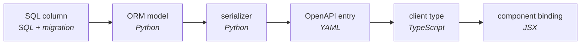

# The Ideas Behind Jac

Jac can look like a bag of features -- one language for three tiers, a graph
that persists itself, functions implemented by LLMs, a binary that deploys to
Kubernetes. It isn't. Every feature follows from one diagnosis and two bets,
and knowing them makes the rest of the documentation predictable: when you
wonder "how does Jac handle X?", the answer is almost always the one these
ideas force.

This page is the deep *why*. For the practical tour, start with
[Core Concepts](what-makes-jac-different.md); for the same argument made by
counting files, see [Jac vs a Traditional Stack](jac-vs-traditional-stack.md).

---

## The diagnosis: software breaks at its seams

Take the stack a competent team assembles today for an ordinary product: React
frontend, Python API, relational database, cache, task queue, an LLM feature,
containers, CI, infrastructure-as-code. Count the notations a maintainer must
read: four languages where logic lives (TypeScript, Python, SQL, shell), two
presentation notations (JSX, CSS), and six configuration dialects (JSON, TOML,
three unrelated YAML schemas, Dockerfile, HCL, dotenv). Twelve notations. Five
package ecosystems, each with its own resolver and advisory feed.

The number that matters more is harder to see: how many places meaning gets
**re-encoded with no tool checking the encoding**. A boundary where the
representation of meaning must change, and where no compiler or checker can
see both sides, is a *discontinuity* -- and glue code is what discontinuities
cost. Glue is code whose only job is to carry meaning across such a boundary:
the ORM model that restates the SQL schema, the Pydantic schema that restates
the ORM model, the TypeScript interface that restates the Pydantic schema, the
route table that names functions a second time in URL vocabulary, the prompt
template that restates your types in English -- and, oldest of all, the
binding layer that lets the managed language call the native core it secretly
depends on, where a stale signature fails not as a type error but as a
segfault.

That is the path *one value* walks from its source of truth to the pixels that
render it: five dialects, three hand-authored representation changes, and not
one pair of adjacent boxes that any verifier spans. Within TypeScript's
territory, a renamed field is a build error at every stale use. *Between*
territories there is nothing -- the whole-program type checker of the modern
stack is `grep`. Defects don't distribute evenly across a codebase; they pool
at the discontinuities, because a discontinuity is by definition a place where
the machinery that prevents defects has no reach.

Two things make this diagnosis worth acting on rather than accepting:

1. **None of it is required by modularity.** Modules need boundaries and
   interfaces. Nothing requires that a boundary also be a change of language,
   type system, package ecosystem, serialization regime, and deployment unit
   all at once. The conventional stack bundles one good idea (decomposition)
   with five contingent ones and sells them as a package.
2. **None of it is required by computation.** The pattern traces back to two
   assumptions in the 1945 report that defined the stored-program computer:
   that a program's semantics end at the edge of its process, and that
   computation stands still while data is delivered to it. Both were
   engineering defaults for a machine with one memory. Seventy years of habit
   made them look like laws.

Jac is one bet against each assumption.

---

## Bet one: one continuous language, checked end to end

The first bet: a language can present **one continuous semantic medium**
across the ecosystems, tiers, and toolchains that convention treats as
separate worlds -- so that crossing a boundary never requires glue, and the
compiler that checks composition *within* a substrate checks composition
*across* one, because they are the same expression. We call a language with
this property **synechic** (from the Greek *synecheia*, continuity): nothing
about how a program point is written reveals which runtime, package
ecosystem, or toolchain sits beneath it.

The ordering in that sentence -- ecosystems first -- is deliberate.
Languages that unify the *tiers* of a web application have existed for two
decades (the "tierless" research lineage); what no prior language does is
make foreign *ecosystems* native territory, so that PyPI, npm, and the C
world arrive through a plain `import` with no wrapper to find, generate, or
maintain. Tiers are where the pain is most familiar; ecosystems are where
the property earns its name.

Concretely, being synechic is why:

- **Placement is a modifier, not an architecture.** Where code runs is
  declared per-declaration (`cl { }`, `na { }`, a file suffix), never
  per-repository. Moving a function across the client/server boundary is an
  edit, not a rearchitecture. See
  [codespaces](what-makes-jac-different.md#1-how-can-one-language-target-frontends-backends-and-native-binaries-at-the-same-time).
- **Every ecosystem enters through the ordinary import.** PyPI, npm, and C
  libraries arrive via `import` with no binding generators or wrapper
  packages, because each codespace compiles into its host substrate as a
  first-class citizen -- ordinary bytecode among bytecode, ordinary JavaScript
  among JavaScript, machine code with a C ABI. See
  [Import Anything](import-anything.md).
- **One declaration per contract.** A `node` declared once is the same type in
  the store, on the wire, and in the browser; the compiler owns every
  representation in between. Rename a field and every stale use in every tier
  is a compile error. In the conventional stack, that same rename is a textual
  search whose misses ship.
- **Memory discipline is a dial, not a language choice.** The deepest
  boundary in the census is drawn where memory management changes: it is why
  "the Python kind" and "the Rust kind" of language are different languages,
  and why every managed app with a native core carries binding glue between
  the two. Jac renders that divide as a gradient inside one checked medium:
  garbage-collected by default, with ownership and borrowing (`own`, `&`,
  `&mut`) adopted binding by binding, verified statically, required on the
  native pathway, and leaving unannotated code completely unaffected --
  every step reversible. See
  [Ownership & Borrowing](../reference/language/ownership-borrowing.md).
- **The toolchain is inside the language.** Version skew is a discontinuity in
  *time* -- the same marshaling failure, with the filesystem as the wire
  format -- so the `jac` binary internalizes the interpreter, compilers,
  linker, package managers, server, and deployer under one content-addressed
  version. "Works on my machine" stops being a sentence with content. See
  [One Binary, Build Anything](one-binary.md).
- **The LLM is a substrate too.** A hand-written prompt is a marshaling layer:
  it restates your types in prose, and nothing checks the restatement, so it
  silently rots when the code moves on. `by llm()` makes the model a declared
  executor of an ordinary typed function, with the prompt *derived from the
  program* (names, types, `sem` annotations) so it cannot drift, and the
  return type enforced as an output schema. See
  [Core Concepts, part 4](what-makes-jac-different.md).
- **The deployment is not the program.** One user or many, one machine or
  many, transient or persistent: the program text does not change (`jac run`
  -> `jac start` -> `jac start --scale`), because deployment shape is a
  runtime concern, the way garbage collection is a runtime concern. See
  [the scale-invariance contract](../reference/plugins/jac-scale.md#the-scale-invariance-contract).

### The boundaries Jac refuses to hide

A famous 1994 critique of RPC systems observed that latency, partial failure,
and concurrency make remote interaction *genuinely* different from local
interaction -- and that systems which paper over the difference collapse when
it asserts itself, at runtime, at the worst moment. The synechic answer is to
treat that critique as a design rule rather than an objection:

> Dissolve every boundary that is an artifact of representation. Surface every
> boundary that is physics -- as typed, visible semantics at the point where
> it exists.

This is why cross-tier calls are `async` (latency is real, so control flow
must acknowledge it), why write conflicts under concurrency surface as replay
or a typed error rather than silent corruption, and why data sharing across
users takes an explicit `grant` (isolation is the default geometry; sharing is
the act that deserves ceremony). What is dissolved is the paperwork: the
duplicated schemas, the route strings, the serializers. What remains visible
is the world.

---

## Bet two: computation moves to the data

The second bet inverts the deeper assumption. In every mainstream language,
the site of computation is fixed and data is delivered to it -- from memory to
processor, disk to memory, database to application server, vector store to
prompt. The database ships rows to compute because computation cannot go to
the data; the cache exists to disguise the cost of the shipping.

In Jac's Object-Spatial Programming, the locus of computation is itself a
first-class, mobile construct. Data lives as a persistent topology of typed
nodes and edges; the unit of program is the **walker**, a typed, stateful
locus that travels along the topology; and code is dispatched **by arrival**
-- the runtime matches the type of the arriving walker against the type of
the node it lands on, and either side of the encounter can declare what
happens. Where the inherited question is "how do I bring the data here?", the
Jac question is "how does the computation get there?"

Three habits shift when you program this way:

1. **Relationships stop being encodings.** No follower-ID lists, no join
   tables: you draw a `Follow` edge, and the whiteboard diagram *is* the data
   model.
2. **Queries become paths.** "The tweets of everyone this user follows" is
   not a join to compose but a route to name:
   `[me->:Follow:->[?:Profile]-->[?:Tweet]]`.
3. **Algorithms become itineraries.** Instead of a procedure that branches on
   what it holds, a walker's abilities say what to do at each kind of place,
   and arrival does the dispatch.

The bet pays off where the domain has shape -- users, sessions, workflows,
knowledge, and above all **agent memory**. The standard memory-bearing AI
agent is a miniature fragmented stack: an app, a vector store behind an API,
and prompt-assembly glue between them. Object-spatially, an agent's memory is
a topology hung from the root; remembering is walking; and context assembly
becomes path selection in a language that has a semantics for paths. See
[Graphs & Walkers](../tutorials/language/osp.md).

Persistence closes the loop. The rule is one sentence: **whatever is reachable
from `root` persists.** No connection to open, no ORM, no save call --
durability is a property a datum has by where it stands, exactly as liveness
under garbage collection is a property of reachability from roots. One rule
decides what survives the past (collection) and what survives into the future
(persistence). And because every user of a served deployment gets a root of
their own, isolation is not tenancy code -- it is the shape of the graph. A
walker spawned at your root cannot wander into someone else's data because no
edge leads there.

---

## Why this matters more in the era of AI authorship

Coding models now write a large share of new code, which tempts a shortcut:
if machines can emit the four copies of a record in seconds, who cares about
the copies? The inference fails three ways.

First, glue is the most mechanically derivable text in software, and it
dominates the corpora the models learned from -- a generator of code is,
before anything else, a generator of glue. Second, glue's cost was never the
typing; it is **verification**. Discontinuities are precisely the program
points no tool can check, so cheap generation against fixed verification cost
just moves the bottleneck: ten times the glue is ten times the unverifiable
surface, and a fluent model drifts more plausibly than a tired human. Third,
every generated serializer and manifest returns to the training corpus as
evidence that this is what software is.

A synechic medium changes the terms for human and machine authors at once. A
whole Jac application fits in one file that fits in a context window; every
cross-tier invariant is a compile-time property, so an agent's mistake is a
diagnostic, not a production incident; and a `sem` annotation is read three
ways -- by the prompt synthesizer as specification, by the maintainer as
documentation, by the coding agent as context. When authorship
is abundant, the scarce resource is *jurisdiction*: the reach of the tools
that can examine a change and say no. A language is where that reach is
decided, and Jac is built to leave no program point where the only reviewer
is hope.

---

## What we don't claim

Honesty is part of the design, so it belongs in the docs too:

- **The physics stays.** Latency, partial failure, and cost are not abstracted
  away; they are surfaced as `async`, typed errors, and explicit operational
  contracts. Scaling to more machines is paid for in machines.
- **OSP is a complement, not a replacement.** Jac is a full imperative
  language (a superset of Python's semantics), and programs with no graph in
  them are none the worse for the paradigm's presence. Walkers earn their keep
  where the domain has shape; a numerical kernel or bulk whole-graph analytics
  is better served by plain functions or a batch engine.
- **The binary is big on purpose.** It carries the same stack you would
  otherwise install piecewise, relocated into one file with one owner. What it
  eliminates is not disk usage but combinatorics -- the version vector of your
  toolchain collapses to length one.

---

## Names for these ideas

The concepts on this page have precise names in Jac's research literature,
defined here once for reference:

| Term | Meaning |
|------|---------|
| **Discontinuity** | A boundary where the representation of meaning must change and no verifier has jurisdiction over the change. |
| **Glue** | Code or configuration whose sole purpose is to carry meaning across a discontinuity, adding no domain behavior. |
| **Synechic** | The property introduced above: one continuous semantic medium across ecosystems, tiers, and toolchains, such that no program point needs glue to cross a substrate boundary. |
| **Substrate transparency** | The formal statement beneath *synechic*: the identity of the runtime, ecosystem, and toolchain at any program point has no bearing on how the program is expressed. |
| **Topokinetic** | The mobile locus of computation over a topology of data is a first-class semantic construct. Object-Spatial Programming is the paradigm that realizes it. |
| **Meaning types** | Semantic annotations (`sem`, plus names and types) from which prompts are synthesized automatically, making LLM delegation a typed language feature rather than string engineering. |
| **Scale invariance** | Program semantics are invariant under deployment-scale change: one user to N, one machine to M, transient to persistent -- same program text. |
| **Gradual ownership** | Memory discipline as a continuum within one language: collector-managed by default, ownership and borrowing (`own`, `&`, `&mut`) adopted per binding and verified statically, reversible at every step. |
| **Lawful boundary** | A boundary that is physics (latency, partial failure, cost) and is therefore surfaced as typed semantics rather than dissolved. |
| **Jurisdiction** | The reach of a verifier -- the set of program points a compiler or checker can actually examine. |

The peer-reviewed foundations behind them are collected on
[Research & Papers](../community/research.md).

---

## Next steps

- [Core Concepts](what-makes-jac-different.md) -- the practical tour of what
  these ideas become in the language
- [Jac vs a Traditional Stack](jac-vs-traditional-stack.md) -- the same
  argument, made by building one app both ways and counting
- [Build an AI Day Planner](../tutorials/first-app/build-ai-day-planner.md) --
  feel all of it in one guided project
