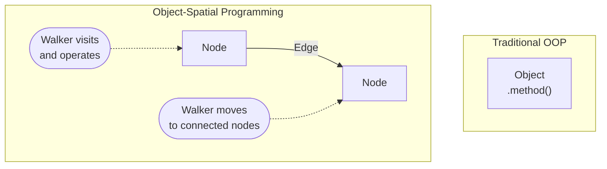
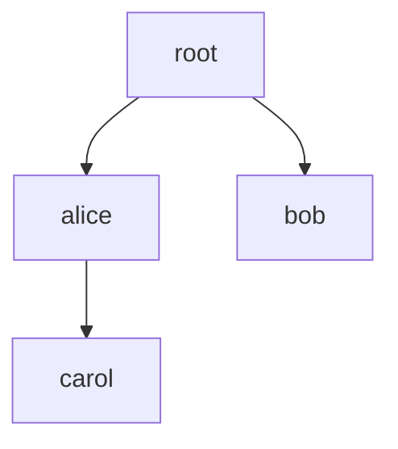

# Object-Spatial Programming

Learn *Object-Spatial Programming* hands-on: nodes, edges, and walkers. OSP is the paradigm realizing Jac's *topokinetic* property ([The Two Ideas](../../quick-guide/ideas-behind-jac.md#topokinetic)): computation moves through a topology of data instead of data streaming to a fixed site of compute.

> **Prerequisites**
>
> - Completed: [Installation](../../quick-guide/install.md)
> - Recommended: [Core Concepts](../../quick-guide/what-makes-jac-different.md) (gentler introduction)
> - Time: ~45 minutes

!!! tip "This is the hands-on tutorial"
    This page teaches OSP by building things step by step. For the complete, authoritative specification of node/edge/walker syntax, see the [OSP reference](../../reference/language/osp.md).

!!! warning "Graph Persistence Between Runs"
    `jac run` persists graph state to a `.jac/` directory. If you run an example multiple times, you may see duplicate nodes or `NodeAnchor ... is not a valid reference!` errors. To start fresh, clean the `.jac/` directory: `jac clean --all`

---

## What is Object-Spatial Programming?

Traditional OOP: Objects exist in isolation. You call methods to bring data to computation.

**Object-Spatial Programming (OSP):** Objects exist in a graph with explicit relationships. You send computation (walkers) to data.



This inversion is older than it looks: every mainstream language inherits the convention that the site of computation is fixed and data is streamed to it -- from the database to the app server, from the store to the prompt. OSP flips the question from "how do I bring the data here?" to "how does the computation get there?"

Three habits shift as you learn to think this way, and this tutorial builds each one:

1. **Relationships stop being encodings** -- no foreign keys or join tables; you draw a typed edge, and the whiteboard diagram *is* the data model.
2. **Queries become paths** -- "friends of friends" is not a join to compose but a route to name.
3. **Algorithms become itineraries** -- a walker's abilities say what to do at each *kind of place*, and arrival does the dispatch.

Control flow doesn't disappear (inside an ability, Jac is a full imperative language); it relocates -- code lives *within* an encounter, and shape lives *between* encounters. The program counter becomes a place.

---

## Nodes: Objects in Space

Nodes are classes that can be connected in a graph.

```jac
node Person {
    has name: str;
    has age: int;

    def greet() -> str {
        return f"Hi, I'm {self.name}!";
    }
}

with entry {
    # Create nodes (just like regular objects)
    alice = Person(name="Alice", age=30);
    bob = Person(name="Bob", age=25);

    # Use them like regular objects
    print(alice.greet());  # Hi, I'm Alice!
    print(bob.age);        # 25
}
```

**Key point:** Nodes are full-featured classes with methods, inheritance, etc. The graph capability is dormant until you connect them.

---

## Connecting Nodes

Use the `++>` operator to connect nodes:

```jac
node Person {
    has name: str;
}

with entry {
    alice = Person(name="Alice");
    bob = Person(name="Bob");
    carol = Person(name="Carol");

    # Connect to root (the default starting node)
    root ++> alice;
    root ++> bob;

    # Connect alice to carol
    alice ++> carol;
}
```

This creates a graph:



---

## Edges: Named Relationships

Edges can carry data and have types:

```jac
node Person {
    has name: str;
}

edge Knows {
    has since: int;      # Year they met
    has strength: str;   # "close", "acquaintance"
}

with entry {
    alice = Person(name="Alice");
    bob = Person(name="Bob");

    # Connect with a typed edge
    alice +>: Knows(since=2020, strength="close") :+> bob;
}
```

A typed edge stores its own data on the connection itself, so "Alice *knows* Bob *since 2020*" lives on the edge rather than on either node. For the full set of connection operators (generic, typed, bidirectional) and typed edge endpoints, see the [Edges reference](../../reference/language/osp.md#edges).

---

## Querying the Graph

Use spatial operators to navigate:

```jac
node Person {
    has name: str;
}

with entry {
    alice = Person(name="Alice");
    bob = Person(name="Bob");
    carol = Person(name="Carol");

    root ++> alice;
    alice ++> bob;
    alice ++> carol;

    # Query connections from root
    people = [root -->];  # All nodes connected to root
    print(len(people));   # 1 (alice)

    # Query from alice
    friends = [alice -->];  # [bob, carol]

    # Filter by type
    only_people = [root -->][?:Person];
}
```

The same edge-reference bracket syntax does a lot: filter by edge type (`[src ->:Knows:->]`), filter results by node type (`[?:Person]`), filter by attribute (`[?age >= 18]`), and chain hops for friends-of-friends (`[alice ->:Knows:-> ->:Knows:->]`). For the complete query grammar, see the [Object Spatial Queries reference](../../reference/language/osp.md#object-spatial-queries).

---

## Walkers: Mobile Computation

**Naming:** `Root` (capitalized) is the type of the root node, used in ability declarations like `can X with Root entry`. `root` (lowercase) is the built-in instance, used in expressions like `root ++> node` or `root spawn Walker()`.

Walkers are objects that traverse the graph and execute abilities at each node.

```jac
node Person {
    has name: str;
    has visited: bool = False;
}

walker Greeter {
    can start with Root entry {
        visit [-->];  # Visit nodes connected to root
    }

    can greet with Person entry {
        print(f"Hello, {here.name}!");
        here.visited = True;
    }
}

with entry {
    alice = Person(name="Alice");
    bob = Person(name="Bob");

    root ++> alice;
    alice ++> bob;

    # Spawn walker at root
    root spawn Greeter();
}
```

**Output:**

```
Hello, Alice!
```

!!! warning "Walkers need explicit traversal"
    A walker spawned at `root` starts there but doesn't automatically visit connected nodes. You must include a `can start with Root entry { visit [-->]; }` ability to begin traversal. Without it, the walker sits at root and its node-specific abilities never fire.

Wait, why only Alice? Because the walker visits root first (via `start`), then visits Alice (via `greet`), but doesn't continue to Bob. The walker needs to be told to continue traversing.

---

## Walker Traversal with `visit`

Use `visit` to continue to connected nodes:

```jac
node Person {
    has name: str;
}

walker Greeter {
    can start with Root entry {
        visit [-->];  # Start by visiting nodes connected to root
    }

    can greet with Person entry {
        print(f"Hello, {here.name}!");
        visit [-->];  # Continue to all connected nodes
    }
}

with entry {
    alice = Person(name="Alice");
    bob = Person(name="Bob");
    carol = Person(name="Carol");

    root ++> alice;
    alice ++> bob;
    alice ++> carol;

    root spawn Greeter();
}
```

**Output:**

```
Hello, Alice!
Hello, Bob!
Hello, Carol!
```

!!! info "`visit` is a promise, not a jump"
    `visit` does **not** move the walker. It *enqueues* destinations: when the current ability finishes, the walker proceeds to the next node in its queue. That's why the default traversal is breadth-first (each node appends its neighbors to the back of the queue), why `visit` at the top of an ability doesn't run other nodes "in the middle of" your code, and why a walker's schedule is fully deterministic -- given the same graph, the same walker visits the same nodes in the same order, every run. You can also steer the queue: `visit : 0 : [-->];` inserts at the *front*, turning the traversal depth-first (see [traversal control](../../reference/language/osp.md#object-spatial-queries) in the reference).

---

## Walker Context Variables

Inside a walker ability, `here` is the current node and `self` is the walker instance. (`visitor` is the mirror image -- it only exists inside *node* abilities, where it names the visiting walker.) For the full table of which special reference is valid in which context, see [Special References](../../reference/language/osp.md#8-special-references).

```jac
node Room {
    has name: str;
}

walker Explorer {
    has rooms_visited: int = 0;

    can explore with Room entry {
        self.rooms_visited += 1;
        print(f"In {here.name}, visited {self.rooms_visited} rooms");
        visit [-->];
    }
}
```

---

## Reporting Results

Use `report` to collect results from walkers:

```jac
node Person {
    has name: str;
    has age: int;
}

walker FindAdults {
    can start with Root entry {
        visit [-->];
    }

    can check with Person entry {
        if here.age >= 18 {
            report here;  # Add to results
        }
        visit [-->];
    }
}

with entry {
    root ++> Person(name="Alice", age=30);
    root ++> Person(name="Bob", age=15);
    root ++> Person(name="Carol", age=25);

    result = root spawn FindAdults();

    print(f"Found {len(result.reports)} adults");
    for person in result.reports {
        print(f"  - {person.name}");
    }
}
```

**Output:**

```
Person(name='Alice', age=30)
Person(name='Carol', age=25)
Found 2 adults
  - Alice
  - Carol
```

The `report` keyword does two things: prints the value to the console, and stores it in `result.reports` for programmatic access.

---

## Stopping Early with `disengage`

Use `disengage` to immediately stop a walker's traversal -- useful when you've found what you're looking for:

```jac
node Person {
    has name: str;
    has age: int;
}

walker FindFirst {
    can start with Root entry {
        visit [-->];
    }

    can check with Person entry {
        if here.age >= 18 {
            report here;
            disengage;  # Stop immediately -- don't visit more nodes
        }
        visit [-->];
    }
}

with entry {
    root ++> Person(name="Alice", age=15);
    root ++> Person(name="Bob", age=25);
    root ++> Person(name="Carol", age=30);

    result = root spawn FindFirst();
    print(f"First adult: {result.reports[0].name}");
}
```

**Output:**

```
Person(name='Bob', age=25)
First adult: Bob
```

Without `disengage`, the walker would continue visiting Carol. With it, the walker stops as soon as it finds Bob. This is especially useful in search walkers where you need to find and modify a specific node (like toggling or deleting a task by ID).

---

## Entry Points

Walkers can have different entry points:

```jac
node Person {
    has name: str;
    has age: int;
}

walker DataProcessor {
    has data: str;

    # Runs when spawned at root
    can start with Root entry {
        print("Starting from root");
        visit [-->];
    }

    # Runs when visiting a Person node
    can process with Person entry {
        print(f"Processing {here.name}");
        visit [-->];
    }

    # Runs only at the spawn location -- a generic `with entry`
    # does NOT fire on every visited node
    can default with entry {
        print("At spawn location");
        visit [-->];
    }
}
```

For the complete event-clause forms (typed entries, `exit` abilities, walker-type unions), see [Node Entry/Exit Abilities](../../reference/language/osp.md#2-node-entryexit-abilities).

---

## Accumulate, Then Deliver: Exit Abilities

Entry abilities run the moment a walker lands. **Exit** abilities are deferred: they run only after everything the walker queued from that node has been fully visited, unwinding like a call stack. This gives OSP its most common idiom -- *accumulate then deliver*: gather state at each node during entry, then report the aggregate once, in an exit ability at the spawn point.

```jac
node Tweet {
    has content: str;
    has likes: int = 0;
}

walker trending {
    has found: list = [];

    can scan with Root entry {
        visit [-->[?:Tweet]];
    }

    can gather with Tweet entry {
        self.found.append((here.likes, here.content));
    }

    can deliver with Root exit {
        self.found.sort(reverse=True);
        report [content for (likes, content) in self.found[:3]];
    }
}
```

The `deliver` ability fires exactly once, after every queued `Tweet` has been visited -- so the walker reports one sorted result instead of a stream of fragments. This is precisely how [littleX](https://github.com/jaseci-labs/jaseci/tree/main/jac/examples/littleX)'s feed works: two `visit` statements define *what* the feed is (my tweets, plus tweets of everyone I follow), entry abilities gather it, and a `with Root exit` ability sorts and delivers it.

---

## Practical Example: Social Network

```jac
node User {
    has username: str;
    has bio: str = "";
}

edge Follows {
    has since: str;
}

walker FindFollowers {
    can find with User entry {
        # Find all users who follow this user
        followers = [<-:Follows:<-];
        for follower in followers {
            report follower;
        }
    }
}

walker FindMutualFollows {
    can find with User entry {
        following = [here ->:Follows:->];
        followers = [here <-:Follows:<-];

        for user in following {
            if user in followers {
                report user;  # Mutual follow!
            }
        }
    }
}

with entry {
    alice = User(username="alice");
    bob = User(username="bob");
    carol = User(username="carol");

    root ++> alice;
    root ++> bob;
    root ++> carol;

    # Alice follows Bob, Bob follows Alice (mutual)
    alice +>: Follows(since="2024") :+> bob;
    bob +>: Follows(since="2024") :+> alice;

    # Carol follows Alice
    carol +>: Follows(since="2024") :+> alice;

    # Find Alice's followers
    result = alice spawn FindFollowers();
    print("Alice's followers:");
    for user in result.reports {
        print(f"  - {user.username}");
    }

    # Find Alice's mutual follows
    result = alice spawn FindMutualFollows();
    print("Alice's mutual follows:");
    for user in result.reports {
        print(f"  - {user.username}");
    }
}
```

**Output:**

```
User(username='bob', bio='')
User(username='carol', bio='')
Alice's followers:
  - bob
  - carol
User(username='bob', bio='')
Alice's mutual follows:
  - bob
```

---

## Running as an API

The same graph code becomes a REST API:

```jac
node Todo {
    has title: str;
    has done: bool = False;
}

walker add_todo {
    has title: str;

    can create with Root entry {
        new_todo = here ++> Todo(title=self.title);
        report new_todo;
    }
}
```

Every public walker becomes an endpoint: its `has` properties become the request body and its `report` values become the response. See [Walkers as REST APIs](../../reference/language/osp.md#walkers-as-rest-apis) for the full treatment.

!!! note
    `main.jac` is the default entry point. If your file has a different name (e.g., `app.jac`), pass it explicitly: `jac start app.jac`.

```bash
# Run as API server
jac start

# Call via HTTP
curl -X POST http://localhost:8000/walker/add_todo \
  -H "Content-Type: application/json" \
  -d '{"title": "Learn OSP"}'
```

---

## When to Use Functions vs Walkers

Jac gives you two ways to expose server logic: `def:pub` functions and `walker` types. The short version: `def:pub` functions are great for simple, stateless CRUD and quick prototyping, while walkers shine for graph traversal, per-user data isolation, and production apps where state accumulates across nodes. For the full side-by-side comparison, see [When to Use Walkers vs Functions](../../reference/language/osp.md#when-to-use-walkers-vs-functions) in the reference.

!!! tip "Rule of thumb"
    Start with `def:pub` to prototype quickly. Switch to walkers when you need authentication, per-user data isolation, or multi-step graph traversal.

!!! note "When OSP is the wrong tool"
    OSP complements Jac's functional and object-oriented core; it doesn't replace it. If the data at hand isn't relational -- a numerical kernel, a string transformer, a stateless utility -- plain functions and `obj` values are the right call, and littleX itself uses them wherever the data has no shape. Whole-graph bulk analytics (PageRank over millions of nodes) is also better served by a batch engine than by a walker. The paradigm earns its keep where entities, their relationships, and computations ranging over both are the substance of the problem: social graphs, workflows, knowledge bases, and agent memory.

The [AI Day Planner Tutorial](../first-app/build-ai-day-planner.md) uses `def:pub` in the early parts, then refactors to walkers in [Part 6](../first-app/build-ai-day-planner.md#part-6-authentication-and-multi-file-organization) -- showing exactly when and why to make the switch.

---

## Key Takeaways

| Concept | Purpose |
|---------|---------|
| `node` | Objects that live in a graph |
| `edge` | Typed relationships between nodes |
| `walker` | Mobile computation that traverses the graph |
| `++>` | Connect nodes |
| `[-->]` | Query connections |
| `visit` | Queue destinations for the walker (movement happens between abilities) |
| `with ... exit` | Deferred ability -- runs after everything queued from that node is visited |
| `report` | Collect results from walker |
| `disengage` | Stop walker traversal immediately |
| `here` | Current node in walker |
| `spawn` | Start walker at a node |

---

## Next Steps

**Continue Learning:**

- [Testing](../../reference/testing.md) - Test your nodes and walkers
- [AI Integration](../ai/quickstart.md) - Add LLM capabilities
- [AI Day Planner Tutorial](../first-app/build-ai-day-planner.md) - Build a complete app with OSP concepts

**Reference:**

- [Graph Operations](../../reference/language/osp.md) - Complete edge/node operator reference
- [Walker Responses](../../reference/language/walker-responses.md) - Understanding `.reports` patterns
- [Part III: OSP](../../reference/language/osp.md) - Full language reference
