## Ability

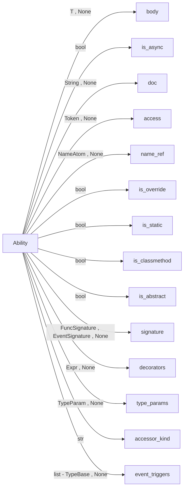

Ability(kid: 'Sequence[UniNode]' = <factory>, *, body: 'T | None', is_async: 'bool' = False, doc: 'String | None' = None, access: 'SubTag[Token] | None' = None, name_ref: 'NameAtom | None', is_override: 'bool', is_static: 'bool', is_classmethod: 'bool', is_abstract: 'bool', signature: 'FuncSignature | EventSignature | None', decorators: 'Sequence[Expr] | None' = None, type_params: 'Sequence[TypeParam] | None' = None, accessor_kind: 'str' = '', event_triggers: 'list[TypeBase] | None' = None)

## ArchHas

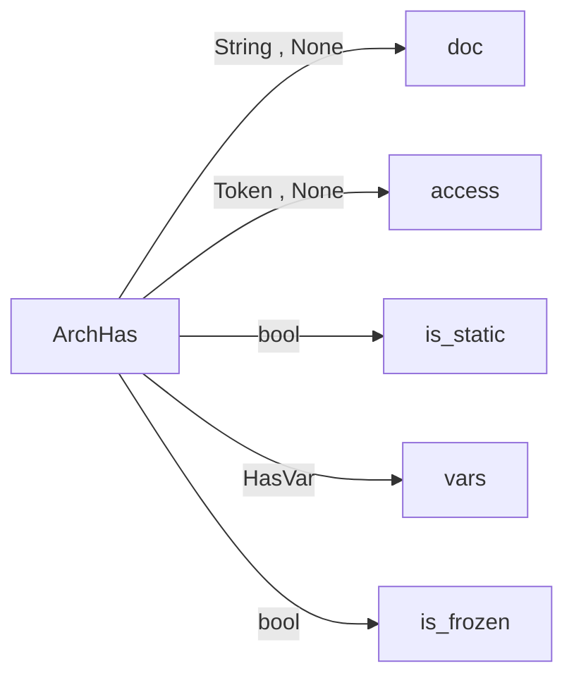

ArchHas(kid: 'Sequence[UniNode]' = <factory>, *, doc: 'String | None' = None, access: 'SubTag[Token] | None' = None, is_static: 'bool', vars: 'Sequence[HasVar]', is_frozen: 'bool')

## Archetype

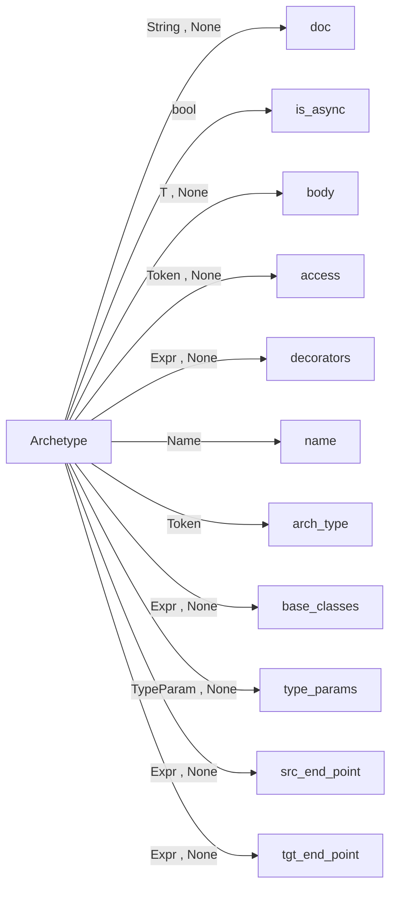

Archetype(kid: 'Sequence[UniNode]' = <factory>, *, doc: 'String | None' = None, is_async: 'bool' = False, body: 'T | None', access: 'SubTag[Token] | None' = None, decorators: 'Sequence[Expr] | None', name: 'Name', arch_type: 'Token', base_classes: 'Sequence[Expr] | None', type_params: 'Sequence[TypeParam] | None' = None, src_endpoint: 'Expr | None' = None, tgt_endpoint: 'Expr | None' = None)

## AssertStmt

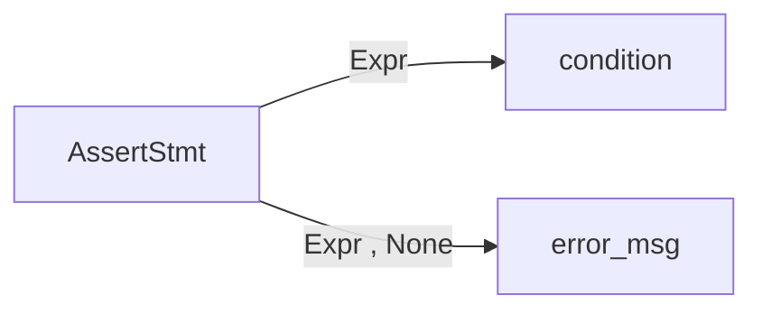

AssertStmt(kid: 'Sequence[UniNode]' = <factory>, *, condition: 'Expr', error_msg: 'Expr | None')

## AssignCompr


AssignCompr(kid: 'Sequence[UniNode]' = <factory>, *, assigns: 'Sequence[KWPair]')

## Assignment

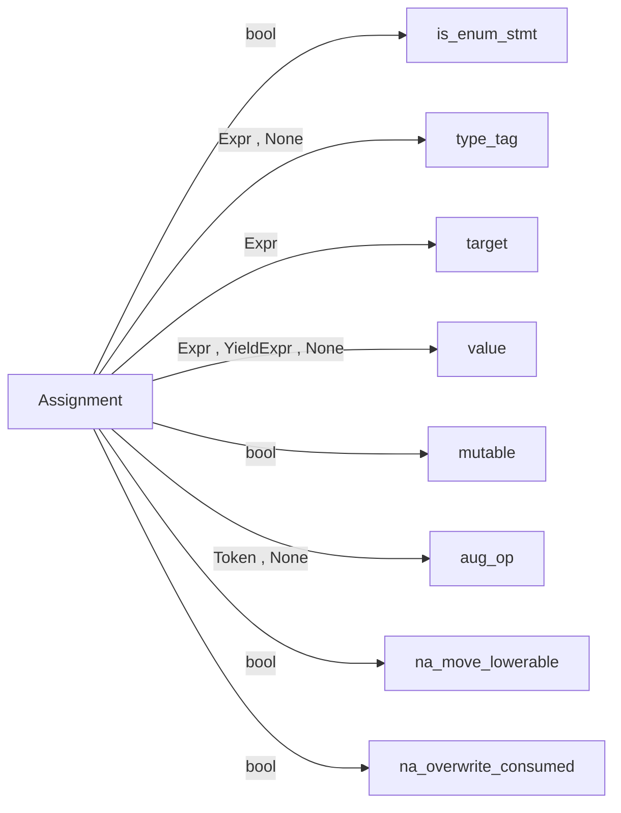

Assignment(kid: 'Sequence[UniNode]' = <factory>, *, is_enum_stmt: 'bool' = False, type_tag: 'SubTag[Expr] | None' = None, target: 'Sequence[Expr]', value: 'Expr | YieldExpr | None', mutable: 'bool' = True, aug_op: 'Token | None' = None, na_move_lowerable: 'bool' = False, na_overwrite_consumed: 'bool' = False)

## AtomTrailer

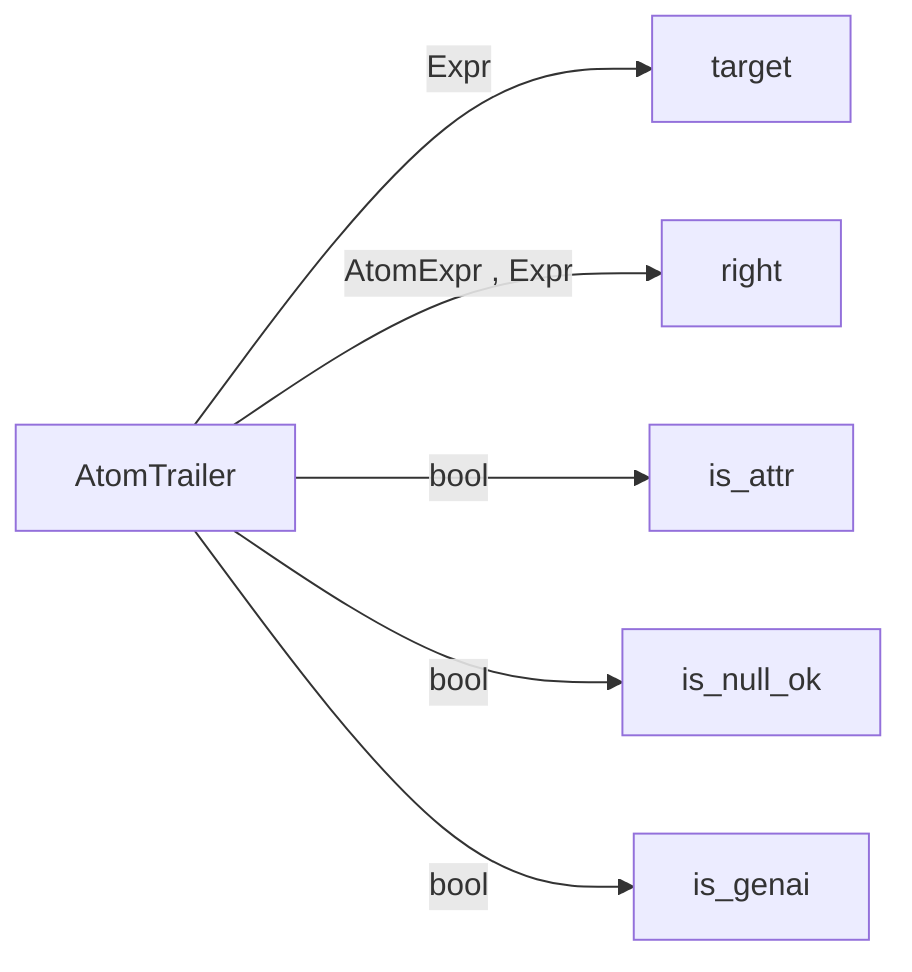

AtomTrailer(kid: 'Sequence[UniNode]' = <factory>, *, target: 'Expr', right: 'AtomExpr | Expr', is_attr: 'bool', is_null_ok: 'bool', is_genai: 'bool' = False)

## AtomUnit

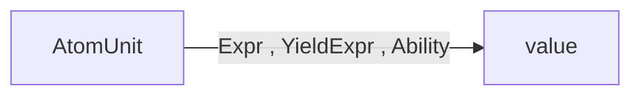

AtomUnit(kid: 'Sequence[UniNode]' = <factory>, *, value: 'Expr | YieldExpr | Ability')

## AwaitExpr

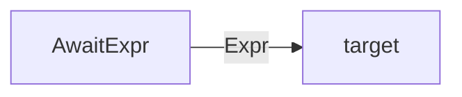

AwaitExpr(kid: 'Sequence[UniNode]' = <factory>, *, target: 'Expr')

## AwaitingClause

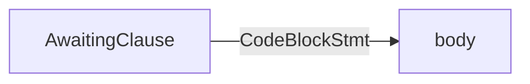

AwaitingClause(kid: 'Sequence[UniNode]' = <factory>, *, body: 'Sequence[CodeBlockStmt]')

## BinaryExpr

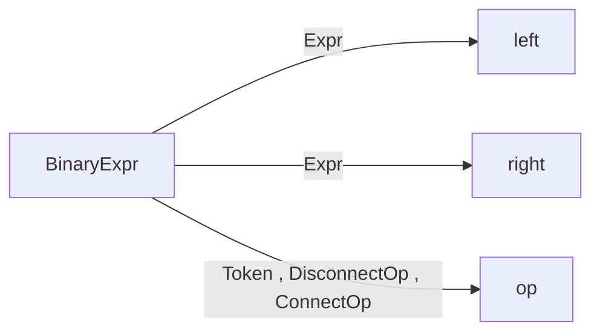

BinaryExpr(kid: 'Sequence[UniNode]' = <factory>, *, left: 'Expr', right: 'Expr', op: 'Token | DisconnectOp | ConnectOp')

## Bool

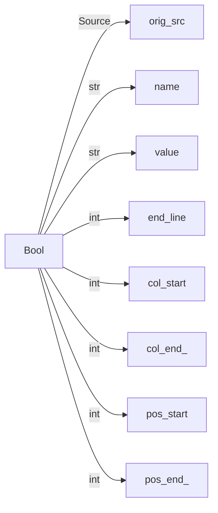

Bool(orig_src: 'Source', name: 'str', value: 'str', line: 'int', end_line: 'int', col_start: 'int', col_end: 'int', pos_start: 'int', pos_end: 'int') -> 'None'

## BoolExpr

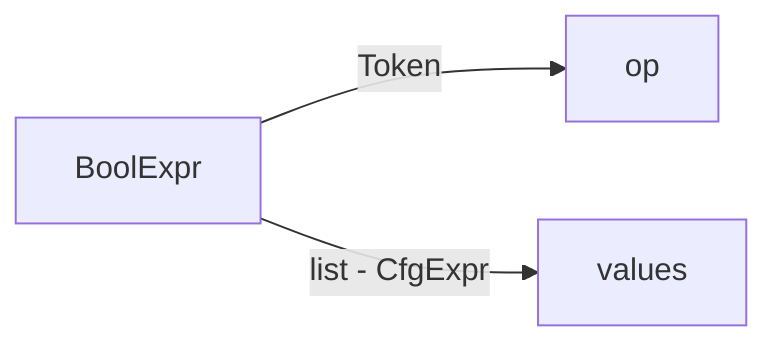

BoolExpr(kid: 'Sequence[UniNode]' = <factory>, *, op: 'Token', values: 'list[CfgExpr]')

## BuiltinType

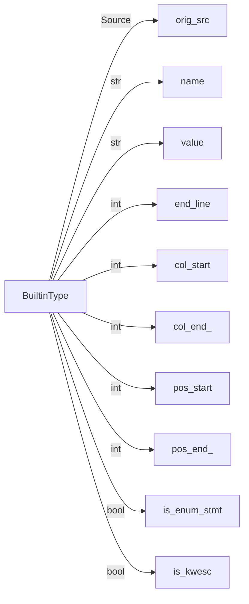

BuiltinType(orig_src: 'Source', name: 'str', value: 'str', line: 'int', end_line: 'int', col_start: 'int', col_end: 'int', pos_start: 'int', pos_end: 'int', is_enum_stmt: 'bool' = False, is_kwesc: 'bool' = False) -> 'None'

## CastExpr

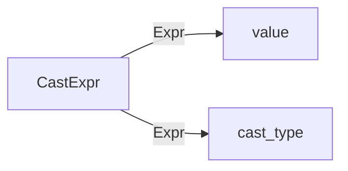

CastExpr(kid: 'Sequence[UniNode]' = <factory>, *, value: 'Expr', cast_type: 'Expr')

## CfgExpr

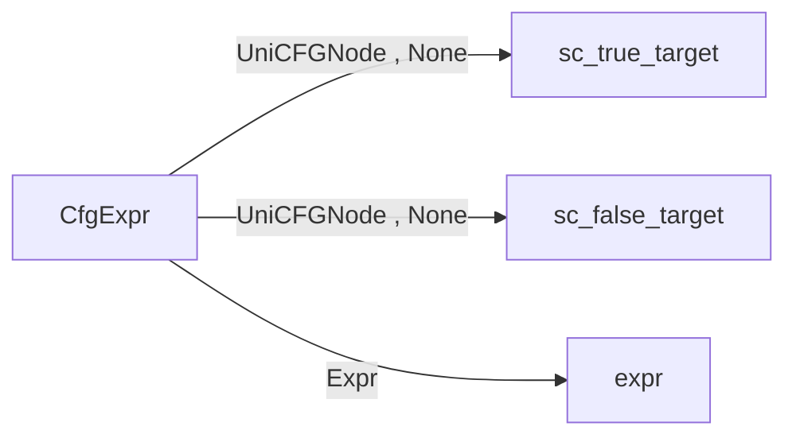

CfgExpr(kid: 'Sequence[UniNode]' = <factory>, *, sc_true_target: 'UniCFGNode | None' = None, sc_false_target: 'UniCFGNode | None' = None, expr: 'Expr')

## ClientBlock

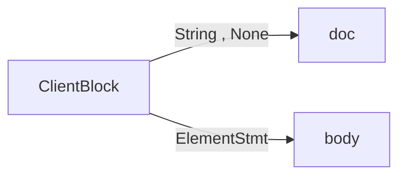

ClientBlock(kid: 'Sequence[UniNode]' = <factory>, *, doc: 'String | None' = None, body: 'Sequence[ElementStmt]')

## CommentToken

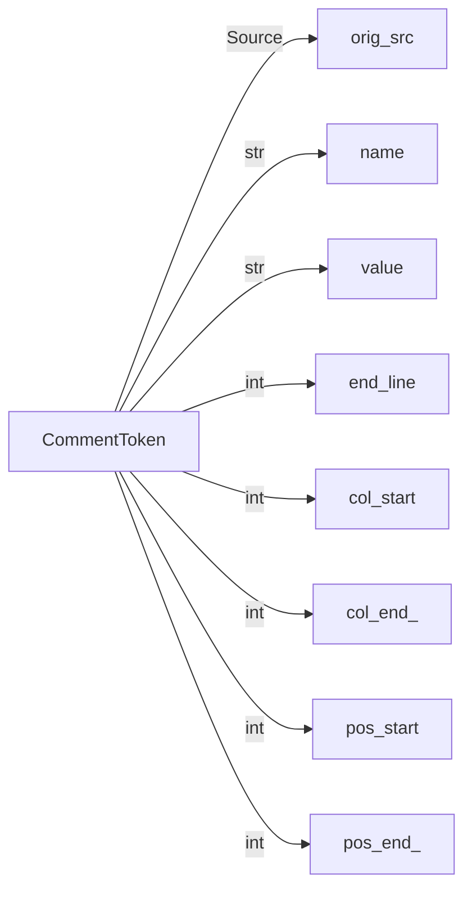

CommentToken(orig_src: 'Source', name: 'str', value: 'str', line: 'int', end_line: 'int', col_start: 'int', col_end: 'int', pos_start: 'int', pos_end: 'int', kid: 'Sequence[UniNode]') -> 'None'

## CompareExpr

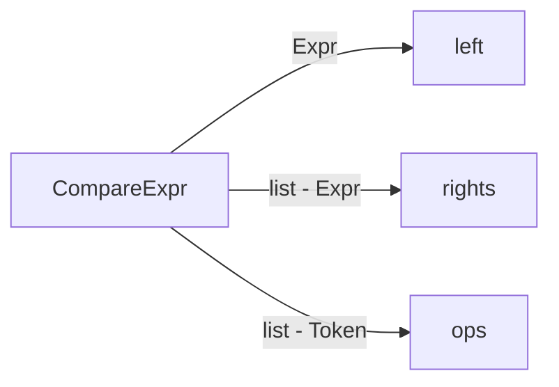

CompareExpr(kid: 'Sequence[UniNode]' = <factory>, *, left: 'Expr', rights: 'list[Expr]', ops: 'list[Token]')

## ConcurrentExpr

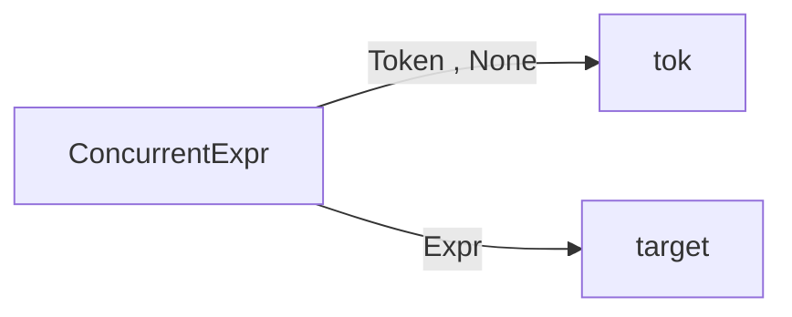

ConcurrentExpr(kid: 'Sequence[UniNode]' = <factory>, *, tok: 'Token | None', target: 'Expr')

## ConditionalNode

```mermaid
flowchart LR
ConditionalNode -->|UniCFGNode , None| sc_true_target
ConditionalNode -->|UniCFGNode , None| sc_false_target
```

ConditionalNode(kid: 'Sequence[UniNode]' = <factory>, *, sc_true_target: 'UniCFGNode | None' = None, sc_false_target: 'UniCFGNode | None' = None)

## ConnectOp

```mermaid
flowchart LR
ConnectOp -->|Expr , None| conn_type
ConnectOp -->|AssignCompr , None| conn_assign
ConnectOp -->|EdgeDir| edge_dir
```

ConnectOp(kid: 'Sequence[UniNode]' = <factory>, *, conn_type: 'Expr | None', conn_assign: 'AssignCompr | None', edge_dir: 'EdgeDir')

## CtrlStmt

```mermaid
flowchart LR
CtrlStmt -->|Token| ctrl
```

CtrlStmt(kid: 'Sequence[UniNode]' = <factory>, *, ctrl: 'Token')

## DeleteStmt

```mermaid
flowchart LR
DeleteStmt -->|Expr| target
```

DeleteStmt(kid: 'Sequence[UniNode]' = <factory>, *, target: 'Expr')

## DictCompr

```mermaid
flowchart LR
DictCompr -->|KVPair| kv_pair
DictCompr -->|list - InnerCompr| compr
```

DictCompr(kid: 'Sequence[UniNode]' = <factory>, *, kv_pair: 'KVPair', compr: 'list[InnerCompr]')

## DictVal

```mermaid
flowchart LR
DictVal -->|KVPair| kv_pairs
```

DictVal(kid: 'Sequence[UniNode]' = <factory>, *, kv_pairs: 'Sequence[KVPair]')

## DisconnectOp

```mermaid
flowchart LR
DisconnectOp -->|EdgeOpRef| edge_spec
```

DisconnectOp(kid: 'Sequence[UniNode]' = <factory>, *, edge_spec: 'EdgeOpRef')

## EdgeOpRef

```mermaid
flowchart LR
EdgeOpRef -->|FilterCompr , None| filter_cond
EdgeOpRef -->|EdgeDir| edge_dir
```

EdgeOpRef(kid: 'Sequence[UniNode]' = <factory>, *, filter_cond: 'FilterCompr | None', edge_dir: 'EdgeDir')

## EdgeRefTrailer

```mermaid
flowchart LR
EdgeRefTrailer -->|list - Expr , FilterCompr| chain
EdgeRefTrailer -->|bool| edges_only
EdgeRefTrailer -->|bool| is_async
```

EdgeRefTrailer(kid: 'Sequence[UniNode]' = <factory>, *, chain: 'list[Expr | FilterCompr]', edges_only: 'bool', is_async: 'bool')

## Ellipsis

```mermaid
flowchart LR
Ellipsis -->|Source| orig_src
Ellipsis -->|str| name
Ellipsis -->|str| value
Ellipsis -->|int| end_line
Ellipsis -->|int| col_start
Ellipsis -->|int| col_end_
Ellipsis -->|int| pos_start
Ellipsis -->|int| pos_end_
```

Ellipsis(orig_src: 'Source', name: 'str', value: 'str', line: 'int', end_line: 'int', col_start: 'int', col_end: 'int', pos_start: 'int', pos_end: 'int') -> 'None'

## ElseIf

```mermaid
flowchart LR
ElseIf -->|ElseStmt , ElseIf , None| else_body
ElseIf -->|Expr| condition
ElseIf -->|CodeBlockStmt| body
```

ElseIf(kid: 'Sequence[UniNode]' = <factory>, *, else_body: 'ElseStmt | ElseIf | None' = None, condition: 'Expr', body: 'Sequence[CodeBlockStmt]')

## ElseStmt

```mermaid
flowchart LR
ElseStmt -->|CodeBlockStmt| body
```

ElseStmt(kid: 'Sequence[UniNode]' = <factory>, *, body: 'Sequence[CodeBlockStmt]')

## Enum

```mermaid
flowchart LR
Enum -->|String , None| doc
Enum -->|bool| is_async
Enum -->|T , None| body
Enum -->|Token , None| access
Enum -->|Expr , None| decorators
Enum -->|Name| name
Enum -->|Expr , None| value_type
Enum -->|Expr , None| base_classes
```

Enum(kid: 'Sequence[UniNode]' = <factory>, *, doc: 'String | None' = None, is_async: 'bool' = False, body: 'T | None', access: 'SubTag[Token] | None' = None, decorators: 'Sequence[Expr] | None', name: 'Name', value_type: 'Expr | None', base_classes: 'Sequence[Expr] | None')

## EventSignature

```mermaid
flowchart LR
EventSignature -->|Token| event
EventSignature -->|Expr , None| arch_tag_info
```

EventSignature(kid: 'Sequence[UniNode]' = <factory>, *, event: 'Token', arch_tag_info: 'Expr | None')

## Except

```mermaid
flowchart LR
Except -->|Expr| ex_type
Except -->|Name , None| name
Except -->|CodeBlockStmt| body
```

Except(kid: 'Sequence[UniNode]' = <factory>, *, ex_type: 'Expr', name: 'Name | None', body: 'Sequence[CodeBlockStmt]')

## ExprAsItem

```mermaid
flowchart LR
ExprAsItem -->|Expr| expr
ExprAsItem -->|Expr , None| alias
```

ExprAsItem(kid: 'Sequence[UniNode]' = <factory>, *, expr: 'Expr', alias: 'Expr | None')

## ExprStmt

```mermaid
flowchart LR
ExprStmt -->|Expr| expr
ExprStmt -->|bool| in_fstring
```

ExprStmt(kid: 'Sequence[UniNode]' = <factory>, *, expr: 'Expr', in_fstring: 'bool')

## FString

```mermaid
flowchart LR
FString -->|Token , None| start
FString -->|String , FormattedValue| parts
FString -->|Token , None| end
```

FString(kid: 'Sequence[UniNode]' = <factory>, *, start: 'Token | None', parts: 'Sequence[String | FormattedValue]', end: 'Token | None')

## FilterCompr

```mermaid
flowchart LR
FilterCompr -->|Expr , None| f_type
FilterCompr -->|CompareExpr| compares
```

FilterCompr(kid: 'Sequence[UniNode]' = <factory>, *, f_type: 'Expr | None', compares: 'Sequence[CompareExpr]')

## FinallyStmt

```mermaid
flowchart LR
FinallyStmt -->|CodeBlockStmt| body
```

FinallyStmt(kid: 'Sequence[UniNode]' = <factory>, *, body: 'Sequence[CodeBlockStmt]')

## Float

```mermaid
flowchart LR
Float -->|Source| orig_src
Float -->|str| name
Float -->|str| value
Float -->|int| end_line
Float -->|int| col_start
Float -->|int| col_end_
Float -->|int| pos_start
Float -->|int| pos_end_
```

Float(orig_src: 'Source', name: 'str', value: 'str', line: 'int', end_line: 'int', col_start: 'int', col_end: 'int', pos_start: 'int', pos_end: 'int') -> 'None'

## ForeverStmt

```mermaid
flowchart LR
ForeverStmt -->|CodeBlockStmt| body
```

ForeverStmt(kid: 'Sequence[UniNode]' = <factory>, *, body: 'Sequence[CodeBlockStmt]')

## FormattedValue

```mermaid
flowchart LR
FormattedValue -->|Expr| format_part
FormattedValue -->|int| conversion
FormattedValue -->|Expr , None| format_spec
```

FormattedValue(kid: 'Sequence[UniNode]' = <factory>, *, format_part: 'Expr', conversion: 'int', format_spec: 'Expr | None')

## FuncCall

```mermaid
flowchart LR
FuncCall -->|Expr| target
FuncCall -->|Expr , KWPair , None| params
FuncCall -->|Expr , None| genai_call
FuncCall -->|str , None| call_kind
```

FuncCall(kid: 'Sequence[UniNode]' = <factory>, *, target: 'Expr', params: 'Sequence[Expr | KWPair] | None', genai_call: 'Expr | None', call_kind: 'str | None' = None)

## FuncSignature

```mermaid
flowchart LR
FuncSignature -->|ParamVar| posonly_params
FuncSignature -->|ParamVar , None| params
FuncSignature -->|ParamVar , None| varargs
FuncSignature -->|ParamVar| kwonlyargs
FuncSignature -->|ParamVar , None| kwargs
FuncSignature -->|Expr , None| return_type
```

FuncSignature(kid: 'Sequence[UniNode]' = <factory>, *, posonly_params: 'Sequence[ParamVar]', params: 'Sequence[ParamVar] | None', varargs: 'ParamVar | None', kwonlyargs: 'Sequence[ParamVar]', kwargs: 'ParamVar | None', return_type: 'Expr | None')

## GenCompr

```mermaid
flowchart LR
GenCompr -->|Expr| out_expr
GenCompr -->|list - InnerCompr| compr
```

GenCompr(kid: 'Sequence[UniNode]' = <factory>, *, out_expr: 'Expr', compr: 'list[InnerCompr]')

## GlobalVars

```mermaid
flowchart LR
GlobalVars -->|Token , None| access
GlobalVars -->|String , None| doc
GlobalVars -->|Assignment| assignments
GlobalVars -->|bool| is_frozen
```

GlobalVars(kid: 'Sequence[UniNode]' = <factory>, *, access: 'SubTag[Token] | None' = None, doc: 'String | None' = None, assignments: 'Sequence[Assignment]', is_frozen: 'bool')

## HasVar

```mermaid
flowchart LR
HasVar -->|Expr , None| type_tag
HasVar -->|Name| name
HasVar -->|Expr , None| value
HasVar -->|bool| defer
HasVar -->|Ability , None| accessors
```

HasVar(kid: 'Sequence[UniNode]' = <factory>, *, type_tag: 'SubTag[Expr] | None' = None, name: 'Name', value: 'Expr | None', defer: 'bool', accessors: 'Sequence[Ability] | None' = None)

## IfElseExpr

```mermaid
flowchart LR
IfElseExpr -->|CfgExpr| condition
IfElseExpr -->|CfgExpr| value
IfElseExpr -->|CfgExpr| else_value
```

IfElseExpr(kid: 'Sequence[UniNode]' = <factory>, *, condition: 'CfgExpr', value: 'CfgExpr', else_value: 'CfgExpr')

## IfStmt

```mermaid
flowchart LR
IfStmt -->|ElseStmt , ElseIf , None| else_body
IfStmt -->|Expr| condition
IfStmt -->|CodeBlockStmt| body
```

IfStmt(kid: 'Sequence[UniNode]' = <factory>, *, else_body: 'ElseStmt | ElseIf | None' = None, condition: 'Expr', body: 'Sequence[CodeBlockStmt]')

## ImplDef

```mermaid
flowchart LR
ImplDef -->|String , None| doc
ImplDef -->|Expr , None| decorators
ImplDef -->|NameAtom| target
ImplDef -->|Expr , FuncSignature , EventSignature , None| spec
ImplDef -->|CodeBlockStmt , EnumBlockStmt , Expr| body
ImplDef -->|UniNode , None| decl_link
```

ImplDef(kid: 'Sequence[UniNode]' = <factory>, *, doc: 'String | None' = None, decorators: 'Sequence[Expr] | None', target: 'Sequence[NameAtom]', spec: 'Sequence[Expr] | FuncSignature | EventSignature | None', body: 'Sequence[CodeBlockStmt] | Sequence[EnumBlockStmt] | Expr', decl_link: 'UniNode | None' = None)

## Import

```mermaid
flowchart LR
Import -->|String , None| doc
Import -->|ModulePath , None| from_loc
Import -->|ModuleItem , ModulePath| items
Import -->|bool| is_absorb
Import -->|bool| is_typed
Import -->|UniNode , None| clib_decls
```

Import(kid: 'Sequence[UniNode]' = <factory>, *, doc: 'String | None' = None, from_loc: 'ModulePath | None', items: 'Sequence[ModuleItem] | Sequence[ModulePath]', is_absorb: 'bool', is_typed: 'bool' = False, clib_decls: 'Sequence[UniNode] | None' = None)

## InForStmt

```mermaid
flowchart LR
InForStmt -->|ElseStmt , ElseIf , None| else_body
InForStmt -->|bool| is_async
InForStmt -->|Expr| target
InForStmt -->|Expr| collection
InForStmt -->|CodeBlockStmt| body
```

InForStmt(kid: 'Sequence[UniNode]' = <factory>, *, else_body: 'ElseStmt | ElseIf | None' = None, is_async: 'bool' = False, target: 'Expr', collection: 'Expr', body: 'Sequence[CodeBlockStmt]')

## IndexSlice

```mermaid
flowchart LR
IndexSlice -->|list - Slice| slices
IndexSlice -->|bool| is_range
```

IndexSlice(kid: 'Sequence[UniNode]' = <factory>, *, slices: 'list[Slice]', is_range: 'bool')

## InnerCompr

```mermaid
flowchart LR
InnerCompr -->|bool| is_async
InnerCompr -->|Expr| target
InnerCompr -->|Expr| collection
InnerCompr -->|list - Expr , None| conditional
```

InnerCompr(kid: 'Sequence[UniNode]' = <factory>, *, is_async: 'bool' = False, target: 'Expr', collection: 'Expr', conditional: 'list[Expr] | None')

## Int

```mermaid
flowchart LR
Int -->|Source| orig_src
Int -->|str| name
Int -->|str| value
Int -->|int| end_line
Int -->|int| col_start
Int -->|int| col_end_
Int -->|int| pos_start
Int -->|int| pos_end_
```

Int(orig_src: 'Source', name: 'str', value: 'str', line: 'int', end_line: 'int', col_start: 'int', col_end: 'int', pos_start: 'int', pos_end: 'int') -> 'None'

## IterForStmt

```mermaid
flowchart LR
IterForStmt -->|ElseStmt , ElseIf , None| else_body
IterForStmt -->|bool| is_async
IterForStmt -->|Assignment| iter
IterForStmt -->|Expr| condition
IterForStmt -->|Assignment| count_by
IterForStmt -->|CodeBlockStmt| body
```

IterForStmt(kid: 'Sequence[UniNode]' = <factory>, *, else_body: 'ElseStmt | ElseIf | None' = None, is_async: 'bool' = False, iter: 'Assignment', condition: 'Expr', count_by: 'Assignment', body: 'Sequence[CodeBlockStmt]')

## JsxComment

```mermaid
flowchart LR
JsxComment -->|Token| value
```

JsxComment(kid: 'Sequence[UniNode]' = <factory>, *, value: 'Token')

## JsxElement

```mermaid
flowchart LR
JsxElement -->|JsxElementName , None| name
JsxElement -->|JsxAttribute , None| attributes
JsxElement -->|JsxChild , JsxElement , None| children
JsxElement -->|bool| is_self_closing
JsxElement -->|bool| is_fragment
JsxElement -->|Expr , None| dynamic_tag
```

JsxElement(kid: 'Sequence[UniNode]' = <factory>, *, name: 'JsxElementName | None', attributes: 'Sequence[JsxAttribute] | None', children: 'Sequence[JsxChild | JsxElement] | None', is_self_closing: 'bool', is_fragment: 'bool', dynamic_tag: 'Expr | None' = None)

## JsxElementName

```mermaid
flowchart LR
JsxElementName -->|Name , Token| parts
```

JsxElementName(kid: 'Sequence[UniNode]' = <factory>, *, parts: 'Sequence[Name | Token]')

## JsxExpression

```mermaid
flowchart LR
JsxExpression -->|Expr| expr
```

JsxExpression(kid: 'Sequence[UniNode]' = <factory>, *, expr: 'Expr')

## JsxNormalAttribute

```mermaid
flowchart LR
JsxNormalAttribute -->|Name , Token| name
JsxNormalAttribute -->|String , Expr , None| value
JsxNormalAttribute -->|bool| is_shorthand
```

JsxNormalAttribute(kid: 'Sequence[UniNode]' = <factory>, *, name: 'Name | Token', value: 'String | Expr | None', is_shorthand: 'bool' = False)

## JsxSlot

```mermaid
flowchart LR
JsxSlot -->|list - UniNode| body
```

JsxSlot(kid: 'Sequence[UniNode]' = <factory>, *, body: 'list[UniNode]')

## JsxSpreadAttribute

```mermaid
flowchart LR
JsxSpreadAttribute -->|Expr| expr
```

JsxSpreadAttribute(kid: 'Sequence[UniNode]' = <factory>, *, expr: 'Expr')

## JsxText

```mermaid
flowchart LR
JsxText -->|str , Token| value
```

JsxText(kid: 'Sequence[UniNode]' = <factory>, *, value: 'str | Token')

## KVPair

```mermaid
flowchart LR
KVPair -->|Expr , None| key
KVPair -->|Expr| value
```

KVPair(kid: 'Sequence[UniNode]' = <factory>, *, key: 'Expr | None', value: 'Expr')

## KWPair

```mermaid
flowchart LR
KWPair -->|NameAtom , None| key
KWPair -->|Expr| value
```

KWPair(kid: 'Sequence[UniNode]' = <factory>, *, key: 'NameAtom | None', value: 'Expr')

## LambdaExpr

```mermaid
flowchart LR
LambdaExpr -->|Expr , CodeBlockStmt| body
LambdaExpr -->|FuncSignature , None| signature
```

LambdaExpr(kid: 'Sequence[UniNode]' = <factory>, *, body: 'Expr | Sequence[CodeBlockStmt]', signature: 'FuncSignature | None' = None)

## ListCompr

```mermaid
flowchart LR
ListCompr -->|Expr| out_expr
ListCompr -->|list - InnerCompr| compr
```

ListCompr(kid: 'Sequence[UniNode]' = <factory>, *, out_expr: 'Expr', compr: 'list[InnerCompr]')

## ListVal

```mermaid
flowchart LR
ListVal -->|Expr| values
```

ListVal(kid: 'Sequence[UniNode]' = <factory>, *, values: 'Sequence[Expr]')

## MatchArch

```mermaid
flowchart LR
MatchArch -->|AtomTrailer , NameAtom| name
MatchArch -->|MatchPattern , None| arg_patterns
MatchArch -->|MatchKVPair , None| kw_patterns
```

MatchArch(kid: 'Sequence[UniNode]' = <factory>, *, name: 'AtomTrailer | NameAtom', arg_patterns: 'Sequence[MatchPattern] | None', kw_patterns: 'Sequence[MatchKVPair] | None')

## MatchAs

```mermaid
flowchart LR
MatchAs -->|NameAtom| name
MatchAs -->|MatchPattern , None| pattern
```

MatchAs(kid: 'Sequence[UniNode]' = <factory>, *, name: 'NameAtom', pattern: 'MatchPattern | None')

## MatchCase

```mermaid
flowchart LR
MatchCase -->|MatchPattern| pattern
MatchCase -->|Expr , None| guard
MatchCase -->|list - CodeBlockStmt| body
```

MatchCase(kid: 'Sequence[UniNode]' = <factory>, *, pattern: 'MatchPattern', guard: 'Expr | None', body: 'list[CodeBlockStmt]')

## MatchKVPair

```mermaid
flowchart LR
MatchKVPair -->|MatchPattern , NameAtom , AtomExpr| key
MatchKVPair -->|MatchPattern| value
```

MatchKVPair(kid: 'Sequence[UniNode]' = <factory>, *, key: 'MatchPattern | NameAtom | AtomExpr', value: 'MatchPattern')

## MatchMapping

```mermaid
flowchart LR
MatchMapping -->|list - MatchKVPair , MatchStar| values
```

MatchMapping(kid: 'Sequence[UniNode]' = <factory>, *, values: 'list[MatchKVPair | MatchStar]')

## MatchOr

```mermaid
flowchart LR
MatchOr -->|list - MatchPattern| patterns
```

MatchOr(kid: 'Sequence[UniNode]' = <factory>, *, patterns: 'list[MatchPattern]')

## MatchSequence

```mermaid
flowchart LR
MatchSequence -->|list - MatchPattern| values
```

MatchSequence(kid: 'Sequence[UniNode]' = <factory>, *, values: 'list[MatchPattern]')

## MatchSingleton

```mermaid
flowchart LR
MatchSingleton -->|Bool , Null| value
```

MatchSingleton(kid: 'Sequence[UniNode]' = <factory>, *, value: 'Bool | Null')

## MatchStar

```mermaid
flowchart LR
MatchStar -->|NameAtom| name
MatchStar -->|bool| is_list
```

MatchStar(kid: 'Sequence[UniNode]' = <factory>, *, name: 'NameAtom', is_list: 'bool')

## MatchStmt

```mermaid
flowchart LR
MatchStmt -->|Expr| target
MatchStmt -->|list - MatchCase| cases
```

MatchStmt(kid: 'Sequence[UniNode]' = <factory>, *, target: 'Expr', cases: 'list[MatchCase]')

## MatchValue

```mermaid
flowchart LR
MatchValue -->|Expr| value
```

MatchValue(kid: 'Sequence[UniNode]' = <factory>, *, value: 'Expr')

## Module

```mermaid
flowchart LR
Module -->|String , None| doc
Module -->|str| name
Module -->|Source| source
Module -->|ElementStmt , String , EmptyToken| body
Module -->|list - Token| terminals
Module -->|bool| stub_only
Module -->|list - Token| src_terminals
Module -->|bool| is_raised_from_py
```

Module(kid: 'Sequence[UniNode]' = <factory>, *, doc: 'String | None' = None, name: 'str', source: 'Source', body: 'Sequence[ElementStmt | String | EmptyToken]', terminals: 'list[Token]', stub_only: 'bool' = False, src_terminals: 'list[Token]' = <factory>, is_raised_from_py: 'bool' = False)

## ModuleCode

```mermaid
flowchart LR
ModuleCode -->|bool| is_enum_stmt
ModuleCode -->|String , None| doc
ModuleCode -->|Name , None| name
ModuleCode -->|CodeBlockStmt| body
```

ModuleCode(kid: 'Sequence[UniNode]' = <factory>, *, is_enum_stmt: 'bool' = False, doc: 'String | None' = None, name: 'Name | None', body: 'Sequence[CodeBlockStmt]')

## ModuleItem

```mermaid
flowchart LR
ModuleItem -->|Name , Token| name
ModuleItem -->|Name , None| alias
```

ModuleItem(kid: 'Sequence[UniNode]' = <factory>, *, name: 'Name | Token', alias: 'Name | None')

## ModulePath

```mermaid
flowchart LR
ModulePath -->|Name , String , None| path
ModulePath -->|int| level
ModulePath -->|Name , None| alias
```

ModulePath(kid: 'Sequence[UniNode]' = <factory>, *, path: 'Sequence[Name | String] | None', level: 'int', alias: 'Name | None')

## MultiString

```mermaid
flowchart LR
MultiString -->|String , FString| strings
```

MultiString(kid: 'Sequence[UniNode]' = <factory>, *, strings: 'Sequence[String | FString]')

## Name

```mermaid
flowchart LR
Name -->|Source| orig_src
Name -->|str| name
Name -->|str| value
Name -->|int| end_line
Name -->|int| col_start
Name -->|int| col_end_
Name -->|int| pos_start
Name -->|int| pos_end_
Name -->|bool| is_enum_stmt
Name -->|bool| is_kwesc
```

Name(orig_src: 'Source', name: 'str', value: 'str', line: 'int', end_line: 'int', col_start: 'int', col_end: 'int', pos_start: 'int', pos_end: 'int', is_enum_stmt: 'bool' = False, is_kwesc: 'bool' = False) -> 'None'

## NativeBlock

```mermaid
flowchart LR
NativeBlock -->|String , None| doc
NativeBlock -->|ElementStmt| body
```

NativeBlock(kid: 'Sequence[UniNode]' = <factory>, *, doc: 'String | None' = None, body: 'Sequence[ElementStmt]')

## Null

```mermaid
flowchart LR
Null -->|Source| orig_src
Null -->|str| name
Null -->|str| value
Null -->|int| end_line
Null -->|int| col_start
Null -->|int| col_end_
Null -->|int| pos_start
Null -->|int| pos_end_
```

Null(orig_src: 'Source', name: 'str', value: 'str', line: 'int', end_line: 'int', col_start: 'int', col_end: 'int', pos_start: 'int', pos_end: 'int') -> 'None'

## OpenStmt

```mermaid
flowchart LR
OpenStmt -->|Expr| target
OpenStmt -->|CodeBlockStmt| body
```

OpenStmt(kid: 'Sequence[UniNode]' = <factory>, *, target: 'Expr', body: 'Sequence[CodeBlockStmt]')

## ParamVar

```mermaid
flowchart LR
ParamVar -->|Expr , None| type_tag
ParamVar -->|Name| name
ParamVar -->|Token , None| unpack
ParamVar -->|Expr , None| value
```

ParamVar(kid: 'Sequence[UniNode]' = <factory>, *, type_tag: 'SubTag[Expr] | None' = None, name: 'Name', unpack: 'Token | None', value: 'Expr | None')

## PyInlineCode

```mermaid
flowchart LR
PyInlineCode -->|bool| is_enum_stmt
PyInlineCode -->|String , None| doc
PyInlineCode -->|Token| code
```

PyInlineCode(kid: 'Sequence[UniNode]' = <factory>, *, is_enum_stmt: 'bool' = False, doc: 'String | None' = None, code: 'Token')

## RaiseStmt

```mermaid
flowchart LR
RaiseStmt -->|Expr , None| cause
RaiseStmt -->|Expr , None| from_target
```

RaiseStmt(kid: 'Sequence[UniNode]' = <factory>, *, cause: 'Expr | None', from_target: 'Expr | None')

## ReportStmt

```mermaid
flowchart LR
ReportStmt -->|Expr| expr
```

ReportStmt(kid: 'Sequence[UniNode]' = <factory>, *, expr: 'Expr')

## ReturnStmt

```mermaid
flowchart LR
ReturnStmt -->|Expr , None| expr
```

ReturnStmt(kid: 'Sequence[UniNode]' = <factory>, *, expr: 'Expr | None')

## SemDef

```mermaid
flowchart LR
SemDef -->|String , None| doc
SemDef -->|NameAtom| target
SemDef -->|MultiString| value
```

SemDef(kid: 'Sequence[UniNode]' = <factory>, *, doc: 'String | None' = None, target: 'Sequence[NameAtom]', value: 'MultiString')

## Semi

```mermaid
flowchart LR
Semi -->|Source| orig_src
Semi -->|str| name
Semi -->|str| value
Semi -->|int| end_line
Semi -->|int| col_start
Semi -->|int| col_end_
Semi -->|int| pos_start
Semi -->|int| pos_end_
```

Semi(orig_src: 'Source', name: 'str', value: 'str', line: 'int', end_line: 'int', col_start: 'int', col_end: 'int', pos_start: 'int', pos_end: 'int') -> 'None'

## ServerBlock

```mermaid
flowchart LR
ServerBlock -->|String , None| doc
ServerBlock -->|ElementStmt| body
```

ServerBlock(kid: 'Sequence[UniNode]' = <factory>, *, doc: 'String | None' = None, body: 'Sequence[ElementStmt]')

## SetCompr

```mermaid
flowchart LR
SetCompr -->|Expr| out_expr
SetCompr -->|list - InnerCompr| compr
```

SetCompr(kid: 'Sequence[UniNode]' = <factory>, *, out_expr: 'Expr', compr: 'list[InnerCompr]')

## SetVal

```mermaid
flowchart LR
SetVal -->|Expr , None| values
```

SetVal(kid: 'Sequence[UniNode]' = <factory>, *, values: 'Sequence[Expr] | None')

## Slice

```mermaid
flowchart LR
Slice -->|Expr , None| start
Slice -->|Expr , None| stop
Slice -->|Expr , None| step
```

Slice(kid: 'Sequence[UniNode]' = <factory>, *, start: 'Expr | None', stop: 'Expr | None', step: 'Expr | None')

## SpecialVarRef

```mermaid
flowchart LR
SpecialVarRef -->|Name| var
SpecialVarRef -->|bool| is_enum_stmt
```

SpecialVarRef(var: 'Name', is_enum_stmt: 'bool' = False) -> 'None'

## String

```mermaid
flowchart LR
String -->|Source| orig_src
String -->|str| name
String -->|str| value
String -->|int| end_line
String -->|int| col_start
String -->|int| col_end_
String -->|int| pos_start
String -->|int| pos_end_
```

String(orig_src: 'Source', name: 'str', value: 'str', line: 'int', end_line: 'int', col_start: 'int', col_end: 'int', pos_start: 'int', pos_end: 'int') -> 'None'

## SubTag

```mermaid
flowchart LR
SubTag -->|T| tag
SubTag -->|OwnershipKind| ownership
```

SubTag(kid: 'Sequence[UniNode]' = <factory>, *, tag: 'T', ownership: 'OwnershipKind' = <OwnershipKind.NONE: 0>)

## SwitchCase

```mermaid
flowchart LR
SwitchCase -->|MatchPattern , None| pattern
SwitchCase -->|list - CodeBlockStmt| body
```

SwitchCase(kid: 'Sequence[UniNode]' = <factory>, *, pattern: 'MatchPattern | None', body: 'list[CodeBlockStmt]')

## SwitchStmt

```mermaid
flowchart LR
SwitchStmt -->|Expr| target
SwitchStmt -->|list - SwitchCase| cases
```

SwitchStmt(kid: 'Sequence[UniNode]' = <factory>, *, target: 'Expr', cases: 'list[SwitchCase]')

## Test

```mermaid
flowchart LR
Test -->|String , None| doc
Test -->|Name , Token| name
Test -->|CodeBlockStmt| body
Test -->|String , None| description
Test -->|Expr , None| decorators
```

Test(kid: 'Sequence[UniNode]' = <factory>, *, doc: 'String | None' = None, name: 'Name | Token', body: 'Sequence[CodeBlockStmt]', description: 'String | None' = None, decorators: 'Sequence[Expr] | None' = None)

## Token

```mermaid
flowchart LR
Token -->|Source| orig_src
Token -->|str| name
Token -->|str| value
Token -->|int| end_line
Token -->|int| col_start
Token -->|int| col_end_
Token -->|int| pos_start
Token -->|int| pos_end_
```

Token(orig_src: 'Source', name: 'str', value: 'str', line: 'int', end_line: 'int', col_start: 'int', col_end: 'int', pos_start: 'int', pos_end: 'int') -> 'None'

## TryStmt

```mermaid
flowchart LR
TryStmt -->|ElseStmt , ElseIf , None| else_body
TryStmt -->|CodeBlockStmt| body
TryStmt -->|Except| excepts
TryStmt -->|AwaitingClause , None| awaiting_body
TryStmt -->|FinallyStmt , None| finally_body
```

TryStmt(kid: 'Sequence[UniNode]' = <factory>, *, else_body: 'ElseStmt | ElseIf | None' = None, body: 'Sequence[CodeBlockStmt]', excepts: 'Sequence[Except]', awaiting_body: 'AwaitingClause | None', finally_body: 'FinallyStmt | None')

## TupleVal

```mermaid
flowchart LR
TupleVal -->|Expr , KWPair| values
```

TupleVal(kid: 'Sequence[UniNode]' = <factory>, *, values: 'Sequence[Expr | KWPair]')

## TypeAlias

```mermaid
flowchart LR
TypeAlias -->|String , None| doc
TypeAlias -->|Token , None| access
TypeAlias -->|Name| name
TypeAlias -->|TypeParam , None| type_params
TypeAlias -->|Expr| value
```

TypeAlias(kid: 'Sequence[UniNode]' = <factory>, *, doc: 'String | None' = None, access: 'SubTag[Token] | None' = None, name: 'Name', type_params: 'Sequence[TypeParam] | None', value: 'Expr')

## TypeParam

```mermaid
flowchart LR
TypeParam -->|Name| name
TypeParam -->|Expr , None| bound
TypeParam -->|Expr , None| default_val
```

TypeParam(kid: 'Sequence[UniNode]' = <factory>, *, name: 'Name', bound: 'Expr | None', default_val: 'Expr | None')

## TypedCtxBlock

```mermaid
flowchart LR
TypedCtxBlock -->|Expr| type_ctx
TypedCtxBlock -->|CodeBlockStmt| body
```

TypedCtxBlock(kid: 'Sequence[UniNode]' = <factory>, *, type_ctx: 'Expr', body: 'Sequence[CodeBlockStmt]')

## UnaryExpr

```mermaid
flowchart LR
UnaryExpr -->|Expr| operand
UnaryExpr -->|Token| op
UnaryExpr -->|OwnershipKind| ownership
```

UnaryExpr(kid: 'Sequence[UniNode]' = <factory>, *, operand: 'Expr', op: 'Token', ownership: 'OwnershipKind' = <OwnershipKind.NONE: 0>)

## VisitStmt

```mermaid
flowchart LR
VisitStmt -->|ElseStmt , ElseIf , None| else_body
VisitStmt -->|Expr , None| insert_loc
VisitStmt -->|Expr| target
```

VisitStmt(kid: 'Sequence[UniNode]' = <factory>, *, else_body: 'ElseStmt | ElseIf | None' = None, insert_loc: 'Expr | None', target: 'Expr')

## WhileStmt

```mermaid
flowchart LR
WhileStmt -->|ElseStmt , ElseIf , None| else_body
WhileStmt -->|Expr| condition
WhileStmt -->|CodeBlockStmt| body
```

WhileStmt(kid: 'Sequence[UniNode]' = <factory>, *, else_body: 'ElseStmt | ElseIf | None' = None, condition: 'Expr', body: 'Sequence[CodeBlockStmt]')

## WithStmt

```mermaid
flowchart LR
WithStmt -->|bool| is_async
WithStmt -->|ExprAsItem| exprs
WithStmt -->|CodeBlockStmt| body
```

WithStmt(kid: 'Sequence[UniNode]' = <factory>, *, is_async: 'bool' = False, exprs: 'Sequence[ExprAsItem]', body: 'Sequence[CodeBlockStmt]')

## YieldExpr

```mermaid
flowchart LR
YieldExpr -->|Expr , None| expr
YieldExpr -->|bool| with_from
```

YieldExpr(kid: 'Sequence[UniNode]' = <factory>, *, expr: 'Expr | None', with_from: 'bool')
